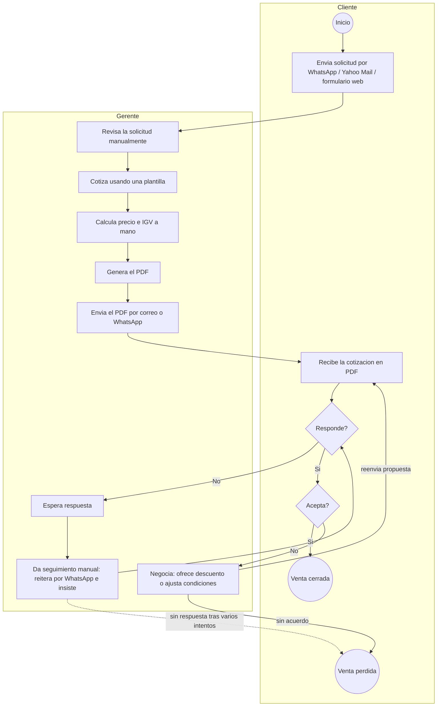
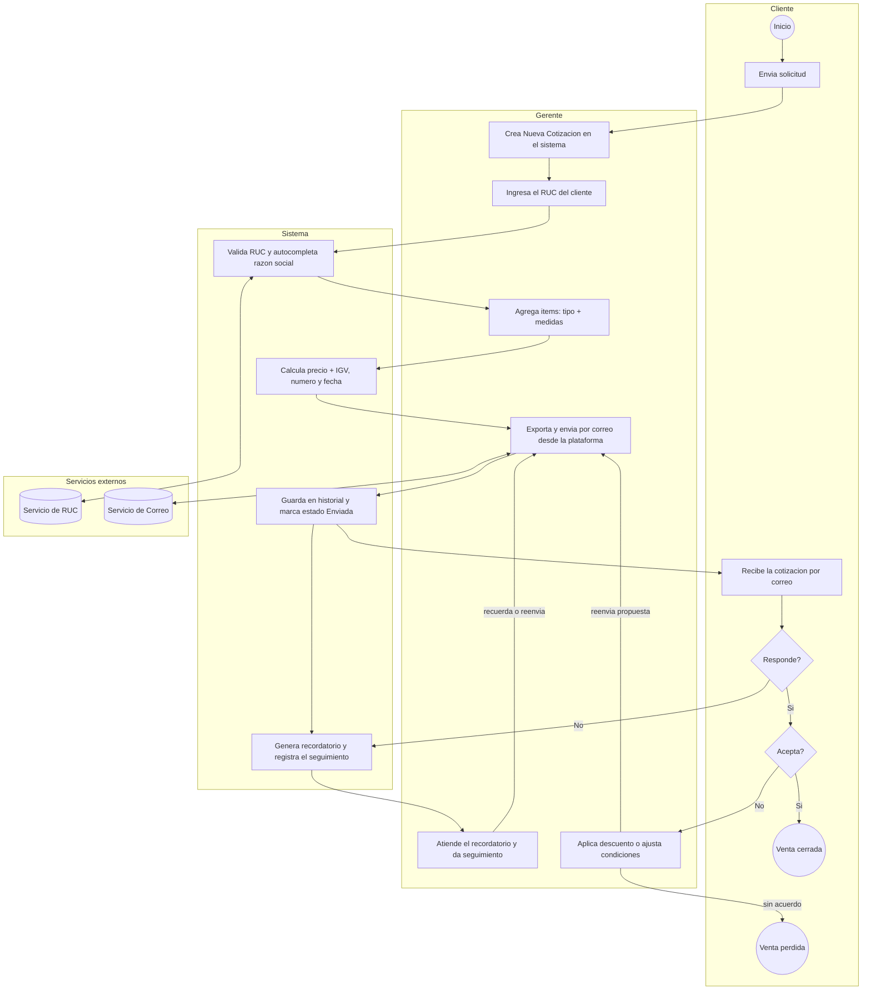
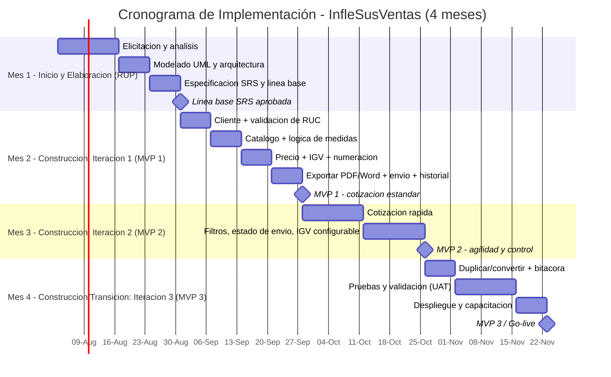

# Semana 1 — Introducción y Encuadre del Proyecto
## Sistema de Gestión de Cotizaciones — "InfleSusVentas"

> **Universidad:** UNMSM — Facultad de Ingeniería de Sistemas e Informática · E.P. Ingeniería de Software
> **Curso:** Ingeniería de Requisitos · **Docente:** Prof. Ciro Rodriguez · Ciclo 5, 2026-I
> **Bloque:** Semana 1 — *Conceptos fundamentales: encuadre del problema*
> **Aporta al entregable:** Capítulos 1–2 (introducción, contexto, objetivos, alcance) · **Criterio de rúbrica:** 1
> **Fecha:** 06/07/2026 · **Versión:** 1.0

---

## Índice del bloque

1. [Introducción del trabajo](#1-introducción-del-trabajo)
2. [Contexto del negocio (InfleSusVentas)](#2-contexto-del-negocio-inflesusventas)
3. [Situación actual (as-is) y enunciado del problema](#3-situación-actual-as-is-y-enunciado-del-problema)
4. [Requisitos del negocio (nivel alto)](#4-requisitos-del-negocio-nivel-alto)
5. [Objetivos](#5-objetivos)
6. [Alcance del proyecto](#6-alcance-del-proyecto)
7. [Limitaciones y restricciones](#7-limitaciones-y-restricciones)
8. [Metodología y modelo de proceso de software](#8-metodología-y-modelo-de-proceso-de-software)
9. [Cronograma de implementación (4 meses)](#9-cronograma-de-implementación-4-meses)
10. [Ficha resumen del proyecto](#10-ficha-resumen-del-proyecto)

> **Nota:** el **glosario de términos** (IGV, RUC, skydancer, tótem, etc.) se consolidará al final del
> documento entregable como **Anexo D**, no en este bloque.

---

## 1. Introducción del trabajo

El presente documento constituye el **primer bloque (Semana 1)** del proyecto final del curso de
**Ingeniería de Requisitos**. Su propósito es **encuadrar el problema**: delimitar qué se va a
resolver, para quién, con qué objetivos y bajo qué límites, antes de entrar a la elicitación y
especificación detallada de requisitos que se abordarán en las semanas siguientes.

El caso de estudio es la empresa **InfleSusVentas**, dedicada a la fabricación y venta de **inflables
publicitarios**. El equipo desarrollará, a lo largo del curso, una **Especificación de Requisitos de
Software (ERS/SRS)** completa para un **sistema web de gestión y generación de cotizaciones** que
reemplace el proceso manual actual de la empresa.

Este bloque distingue explícitamente el **espacio del problema** (necesidades del negocio, "qué" y
"por qué") del **espacio de la solución** (el sistema a construir, "cómo"), tal como exige el enfoque
del curso. Aquí nos concentramos en el **espacio del problema**.

---

## 2. Contexto del negocio (InfleSusVentas)

**InfleSusVentas** es una empresa peruana del rubro de **inflables publicitarios**. Su catálogo
incluye productos como **globos, arcos, carpas, tótems, skydancers** e inflables con **formas
personalizadas** ("otros"). Cuenta con presencia web en el dominio `inflesusventas.com`.

El **corazón operativo del negocio** es la **cotización**: cada cliente potencial solicita un precio
para un inflable con ciertas medidas, y la conversión de esa solicitud en una venta depende de la
**rapidez y precisión** con que la empresa entregue la cotización.

**Actores del negocio identificados en el encuadre:**

| Actor | Rol en el negocio |
|---|---|
| **Gerente** | Recibe solicitudes, cotiza, envía el documento y da seguimiento. Es el **usuario principal** del futuro sistema. |
| **Cliente** | Solicita la cotización (por WhatsApp, correo o formulario web) y recibe el documento. Actor **externo**. |
| **Servicios externos** | Validación de RUC (para razón social) y envío de correo (entrega de la cotización). |

---

## 3. Situación actual (as-is) y enunciado del problema

### 3.1 Flujo actual (as-is)

1. La solicitud del cliente llega por **uno de tres canales**:
   - **WhatsApp** (directo),
   - **Correo** (Yahoo Mail), o
   - **Formulario** de la web `inflesusventas.com` (que **también redirige a WhatsApp** y del cual
     solo se recibe el correo resultante).
2. El **Gerente** revisa la solicitud manualmente.
3. Cotiza usando una **plantilla** (documento base).
4. Genera y envía el documento en **PDF** por correo o WhatsApp.
5. **Espera la confirmación** del cliente.

### 3.2 Enunciado del problema

> **La gestión de cotizaciones de InfleSusVentas es completamente manual**, lo que genera lentitud,
> riesgo de errores de cálculo (precios e IGV), ausencia de numeración y fechado automáticos, y
> **falta de un historial centralizado** de clientes y cotizaciones.

### 3.3 Dolores concretos (pain points)

| # | Dolor actual | Consecuencia |
|---|---|---|
| D1 | Cotización manual con plantilla | Lento; el cliente puede irse a la competencia. |
| D2 | Cálculo manual de precio e **IGV** | Riesgo de errores y de inconsistencia entre cotizaciones. |
| D3 | Sin numeración ni fecha automáticas | Difícil control y trazabilidad de cada cotización. |
| D4 | Información dispersa (WhatsApp, Yahoo, formulario) | No hay historial único de clientes ni de cotizaciones. |
| D5 | Sin validación de identidad del cliente (RUC) | Datos de razón social ingresados a mano, propensos a error. |
| D6 | Envío manual del PDF | Depende del canal y del momento; sin registro de envío. |
| D7 | Sin **seguimiento** sistemático de las cotizaciones enviadas | Las que no reciben respuesta se enfrían; **se pierden ventas** por no insistir a tiempo. |

### 3.4 Costo de no actuar

Si el proyecto **no** se realiza, la empresa mantiene un proceso que **no escala** con el volumen de
solicitudes, **pierde oportunidades de venta** por lentitud y **carece de datos** para analizar su
historial comercial.

### 3.5 Flujo de trabajo actual en BPMN (AS-IS)

Modelo del proceso **manual** actual. Fuente en Mermaid (GitHub la renderiza); la versión con
notación BPMN de diseño (Bizagi / draw.io / Camunda) se exportará a
[`../../04_Recursos/imagenes/bpmn_asis.png`](../../04_Recursos/imagenes/).

**Puntos de dolor sobre el flujo:** los pasos D, E, F y G son **manuales** (dolores D1, D2, D6) y no
hay numeración, fecha ni historial automáticos (D3, D4). Además, el **seguimiento** (H, S, K) es
**manual, ad-hoc y sin recordatorios**: cuando el cliente no responde, la insistencia depende de la
memoria del Gerente, por lo que **muchas cotizaciones se enfrían y se pierden ventas** (dolor D7).

### 3.6 Flujo de negocio propuesto en BPMN (TO-BE)

Modelo del proceso **con el sistema**. Versión de diseño en
[`../../04_Recursos/imagenes/bpmn_tobe.png`](../../04_Recursos/imagenes/). Se refinará en el
modelado de la [Semana 3](../Semana_03_Analisis_y_Modelado/README.md).

**Mejora esperada:** el sistema automatiza la validación de RUC, el cálculo de precio/IGV, la
numeración, la fecha, la exportación, el envío y el historial (dolores D1–D6). Sobre el **seguimiento**
(dolor D7), el sistema **marca el estado** de cada cotización (Enviada / En seguimiento / Aceptada /
Rechazada), **genera recordatorios** cuando no hay respuesta y **registra las interacciones y
negociaciones** (descuentos, reenvíos), de modo que el Gerente actúe a tiempo para **cerrar la venta**.

> Este seguimiento surge como una **nueva capacidad** del sistema; se formaliza como necesidad de
> negocio **RN-08** (sección 4) y se catalogará como requisitos funcionales de **seguimiento** en la
> [Semana 6](../Semana_06_Requisitos_Funcionales/README.md).

---

## 4. Requisitos del negocio (nivel alto)

> Estos son **requisitos de negocio** (necesidades de alto nivel del *espacio del problema*), **no** el
> catálogo detallado de requisitos funcionales/no funcionales. El detalle (RF/RNF/RD) se elaborará en
> las **Semanas 6, 7 y 9**. Se incluyen aquí porque **justifican y delimitan** el proyecto.

| ID | Necesidad de negocio | Origen (dolor) |
|---|---|---|
| RN-01 | Centralizar y agilizar la **generación de cotizaciones**. | D1 |
| RN-02 | **Calcular precios e IGV automáticamente**, según tipo y medida del inflable. | D2 |
| RN-03 | **Numerar y fechar** cada cotización de forma automática. | D3 |
| RN-04 | Mantener un **historial único** de cotizaciones y clientes. | D4 |
| RN-05 | **Validar el RUC** del cliente y autocompletar su razón social. | D5 |
| RN-06 | **Exportar (PDF/Word) y enviar** la cotización desde la plataforma. | D6 |
| RN-07 | Ofrecer un flujo de **cotización rápida** para casos ágiles. | D1 |
| RN-08 | Dar **seguimiento** a las cotizaciones (estados, recordatorios y registro de negociación) para **cerrar más ventas**. | D7 |

---

## 5. Objetivos

### 5.1 Objetivo general (respecto al curso)

> Elaborar la **Especificación de Requisitos de Software (SRS)** de un sistema web de gestión de
> cotizaciones para InfleSusVentas, aplicando de forma integral el proceso de **Ingeniería de
> Requisitos** (elicitación, análisis, especificación, gestión, trazabilidad y validación) visto en
> el curso, siguiendo los estándares **IEEE 830 / ISO-IEC-IEEE 29148**.

### 5.2 Objetivos específicos (académicos, semana a semana)

| # | Objetivo específico | Semana |
|---|---|---|
| OE-1 | Encuadrar el problema: contexto, objetivos, alcance y metodología. | S1 |
| OE-2 | Elicitar necesidades con ≥ 3 técnicas y traducirlas a requisitos. | S2 |
| OE-3 | Modelar el sistema con diagramas UML (casos de uso, actividad, secuencia). | S3–S4 |
| OE-4 | Especificar los requisitos con estándar SRS y casos de uso detallados. | S4 |
| OE-5 | Construir los catálogos de RF, RNF, RD y requisitos de calidad (ISO 25010). | S6–S11 |
| OE-6 | Gestionar requisitos, cambios y trazabilidad. | S5, S12–S13 |
| OE-7 | Validar y verificar los requisitos (walkthrough, prototipo, UAT). | S14 |

### 5.3 Objetivo de negocio (para InfleSusVentas)

> Reducir el **tiempo y los errores** en la generación de cotizaciones y **centralizar** la
> información comercial, aumentando la capacidad de respuesta ante solicitudes de clientes.

---

## 6. Alcance del proyecto

### 6.1 Dentro del alcance (in-scope)

- Registro y gestión de **clientes** con **validación de RUC** y autocompletado de razón social.
- **Catálogo de productos** con lógica de medidas por tipo (globos, arcos, carpas, tótems, skydancers, otros).
- **Cálculo automático** de precios base e **IGV** (desglosado en la cotización).
- **Auto-numeración** correlativa y **fecha de emisión** automática.
- **Exportación** a **PDF y Word** y **envío por correo** desde la plataforma.
- **Interfaz** con **sidebar** (Historial, Clientes, Nueva Cotización).
- **Historial y trazabilidad** por cotización y por cliente.
- Flujo alterno de **Cotización Rápida** (sin RUC, fecha por mes, almacenamiento separado).

### 6.2 Fuera del alcance (out-of-scope)

- **Automatización de la captura** desde WhatsApp / Yahoo Mail / formulario web (la solicitud se
  ingresa manualmente al crear la cotización).
- Módulo de **facturación electrónica** o **contabilidad**.
- **Gestión de inventario/producción** de los inflables.
- **Pasarela de pagos** o cobro en línea.
- Sistema **multiusuario con roles diferenciados** (en esta versión, el usuario es el Gerente).

---

## 7. Limitaciones y restricciones

| ID | Tipo | Restricción |
|---|---|---|
| RES-01 | Legal/Fiscal | El **IGV** vigente es **18 %** (Perú); debe ser **configurable** ante cambios normativos. |
| RES-02 | Negocio | Las **tarifas exactas** por tipo/tamaño **aún no están definidas**; la arquitectura debe soportarlas de forma **parametrizable**. |
| RES-03 | Técnica | Depende de un **servicio externo de validación de RUC** y de un **servicio de correo** disponibles y estables. |
| RES-04 | Operativa | El sistema **no controla** los canales de entrada (WhatsApp/Yahoo/web); la solicitud se registra manualmente. |
| RES-05 | Académica | El proyecto tiene fines **educativos** y se limita a la **especificación de requisitos** (y prototipo), no a un despliegue en producción. |
| RES-06 | Tiempo | El desarrollo se ajusta al **cronograma del curso** (S1–S14). |

---

## 8. Metodología y modelo de proceso de software

### 8.1 Naturaleza del dominio

El dominio de InfleSusVentas es un **proceso de negocio comercial** (cotización), **no crítico ni
fuertemente regulado**, pero con **reglas de negocio claras** (lógica de medidas, cálculo de IGV,
validación de RUC). Es un dominio **relativamente estable** en su lógica de dominio, aunque con
tarifas por definir.

### 8.2 Enfoque de ingeniería de requisitos

Se adopta un enfoque **estructurado por fases del proceso de IR** (elicitación → análisis →
especificación → gestión → validación), **alineado a la secuencia semanal del curso** y a los
estándares **IEEE 830 / ISO-IEC-IEEE 29148**. La priorización de requisitos combina **MoSCoW**,
**Kano** y **Valor vs Costo** (ver Semana 5).

### 8.3 Modelo de proceso de software elegido

Entre los modelos vistos en clase (Sesión 1) se evaluó el ajuste de cada uno al proyecto:

| Modelo (Sesión 1) | Característica | Ajuste a InfleSusVentas |
|---|---|---|
| **Cascada** | Secuencial; cada fase espera a la anterior | Rígido: no permite refinar tarifas/proporción ni entregar por partes. |
| **Ágil (Scrum)** | Iterativo/incremental, adaptable, entrega temprana | Útil por los cambios, pero el dominio ya está bastante definido. |
| **Espiral (Boehm)** | Iteraciones guiadas por riesgos | Pensado para proyectos grandes/alto riesgo; excede este alcance. |
| **RUP** | Iterativo e incremental por fases (Inicio, Elaboración, Construcción, Transición); documentado | Encaja: fases claras + incrementos + trazabilidad. |
| **Prototipos** | Versiones iniciales para retroalimentación | Se usa como **técnica** de validación (Semana 14), no como modelo base. |

> **Decisión: Modelo Incremental basado en RUP** (iterativo e incremental), operado con
> **ceremonias ágiles ligeras** (Scrum: sprint semanal, review, retro, planning).

**Justificación:**
1. Los requisitos están **mayormente claros**, lo que permite planificarlos por **fases** (fortaleza de RUP).
2. Los **MVP 1/2/3** ya definidos (Semana 5) son **incrementos naturales** de entrega.
3. Las **tarifas** y el **factor de proporción del globo** están por definir → las **iteraciones**
   permiten refinarlos sin rehacer todo.
4. RUP prioriza **documentación y trazabilidad**, esenciales en Ingeniería de Requisitos y en la rúbrica.
5. Es el modelo **enfatizado por el docente** en la Sesión 1.

### 8.4 Herramientas del bloque

- **Documento de visión** (este documento) y **diagrama de contexto** (draw.io / PlantUML) — a
  elaborar como artefacto de apoyo.

---

## 9. Cronograma de implementación (4 meses)

El proyecto se implementa en **4 meses**, mapeando las **fases de RUP** con los **incrementos (MVP)**
priorizados en la Semana 5. Cada mes cierra con un **hito** verificable.

| Mes | Fase RUP | Foco / Incremento | Entregable / Hito |
|:--:|---|---|---|
| **1** | Inicio + Elaboración | Elicitación, análisis, modelado UML, arquitectura y **SRS** | Línea base del SRS aprobada |
| **2** | Construcción — Iteración 1 | **MVP 1**: cotización estándar (cliente+RUC, catálogo+medidas, precio+IGV, numeración, export/envío, historial) | **MVP 1** funcional |
| **3** | Construcción — Iteración 2 | **MVP 2**: cotización rápida, filtros, estado de envío, IGV configurable | **MVP 2** funcional |
| **4** | Construcción + Transición | **MVP 3**: duplicar/convertir, bitácora; **pruebas/UAT**, despliegue y capacitación | **Go-live** (sistema entregado) |

### 9.1 Diagrama de Gantt

> Diagrama fuente en Mermaid (GitHub lo renderiza). La versión de diseño para presentación se
> exportará a [`../../04_Recursos/imagenes/cronograma_gantt.png`](../../04_Recursos/imagenes/).
> Las fechas son **referenciales** (inicio ajustable por el equipo).

---

## 10. Ficha resumen del proyecto

| Campo | Detalle |
|---|---|
| **Empresa / caso** | InfleSusVentas (inflables publicitarios) |
| **Problema** | Gestión de cotizaciones 100 % manual, lenta y sin trazabilidad |
| **Objetivo (curso)** | Elaborar la SRS completa del sistema de cotizaciones aplicando IR |
| **Objetivo (negocio)** | Agilizar y centralizar la cotización, reducir errores de precio/IGV |
| **Usuario principal** | Gerente |
| **Tipo de sistema** | Aplicación web de gestión de cotizaciones |
| **Modelo de proceso** | Incremental basado en RUP (iterativo e incremental) + Scrum ligero |
| **Cronograma** | 4 meses (Mes 1: SRS · Mes 2: MVP 1 · Mes 3: MVP 2 · Mes 4: MVP 3 / Go-live) |
| **Alcance in** | Clientes+RUC, catálogo+medidas, precio+IGV, numeración, export PDF/Word, envío, historial, cotización rápida |
| **Alcance out** | Captura automática de canales, facturación, inventario, pagos, multi-rol |
| **Estándar** | IEEE 830 / ISO-IEC-IEEE 29148 · Priorización MoSCoW + Kano + Valor/Costo |
| **Criterio de rúbrica** | 1 (encuadre, objetivos, alcance) |

---

*Fin del bloque — Semana 1 · Introducción y Encuadre · InfleSusVentas · 06/07/2026*
