# 3. ANÁLISIS Y MODELADO (UML)

> **Semana 3** · Sistema de Gestión de Cotizaciones para InfleSusVentas
> Contenido extraído del documento del proyecto (fuente definitiva).

---

3.1 Objetivo de la semana

Representar los requisitos con modelos UML (casos de uso, actividad, secuencia y clases)

para facilitar la comprensión y detectar errores. Todos los diagramas se expresan en PlantUML.

3.2 Acta de reunion

Acta de reunión — Semana 3

Fecha / Hora           18/04/2026, 7:00 p.m.
Modalidad              Virtual
Asistentes             R1, R2, R3, R4
Objetivo del sprint    Construir los modelos UML del sistema.
Acuerdos y tareas      R3 elabora el DCU y el diagrama de clases.
R3 elabora actividad y secuencia.
R2 verifica actores y relaciones include/extend.
Impedimentos           Definir si el cálculo es un CU propio o incluido.
Próxima reunión        25/04/2026

3.3 Actores y objetivos

Actor                  Descripción                                        Principal/Secundario
Gerente / Trabajador Usuario autenticado que opera el sistema             Principal
Servicio de RUC        Valida el RUC y devuelve la razón social           Secundario
Servicio de Correo     Entrega la cotización al cliente                   Secundario

3.4 Diagrama de casos de uso

```plantuml
@startuml                                                       G --> UC1
left to right direction                                         G --> UC2
actor "Gerente / Trabajador" as G                               G --> UC3
actor "Servicio de RUC" as RUC                                  G --> UC6
actor "Servicio de Correo" as MAIL                              G --> UC7
rectangle "Sistema de Cotizaciones InfleSusVentas" {            G --> UC8
  usecase "CU-01 Autenticarse" as UC1                           G --> UC9
  usecase "CU-02 Registrar y validar cliente" as UC2            G --> UC10
  usecase "CU-03 Crear cotizacion" as UC3                       UC2 ..> UC1 : <<include>>
  usecase "CU-04 Aplicar descuento" as UC4                      UC3 ..> UC1 : <<include>>
  usecase "CU-05 Calcular precio e IGV" as UC5                  UC3 ..> UC2 : <<include>>
  usecase "CU-06 Exportar cotizacion" as UC6                    UC3 ..> UC5 : <<include>>
  usecase "CU-07 Enviar cotizacion" as UC7                      UC3 ..> UC4 : <<extend>>
  usecase "CU-08 Consultar historial" as UC8                    UC9 ..> UC3 : <<extend>>
  usecase "CU-09 Cotizacion rapida" as UC9                      UC7 ..> UC10 : <<extend>>
  usecase "CU-10 Dar seguimiento" as UC10                       UC2 --> RUC
}                                                               UC7 --> MAIL
@enduml
```

3.4.1 Modelo de casos de uso del negocio

Además del diagrama de casos de uso del sistema, se modela el negocio según la

disciplina de modelado del negocio del Proceso Unificado: actores de negocio (Cliente, Servicio

de RUC y Servicio de Correo), trabajadores de negocio (Gerente y Trabajador encargado) y

casos de uso de negocio (CUN-01 a CUN-05). Al dibujar a mano, los actores y trabajadores de

negocio llevan una raya sobre la cabeza y los casos de uso de negocio una raya dentro de la

elipse.

Figura 3. Modelo de casos de uso del negocio de InfleSusVentas

```plantuml
@startuml                                                        ' Relaciones
left to right direction                                          Cli --> N1
skinparam packageStyle rectangle                                 Cli --> N2
actor/ "Cliente" as Cli                                          Cli --> N4
actor/ "Servicio de RUC (SUNAT)" as RUC                          N1 ..> N3 : <<include>>
actor/ "Servicio de Correo" as Mail                              N2 ..> N1 : <<extend>>
actor/ "Gerente" as Ger                                          N1 --> RUC
actor/ "Trabajador encargado" as Trab                            N1 --> Mail
rectangle "InfleSusVentas (Negocio)" {                           N2 --> Mail
  usecase/ "CUN-01\nAtender solicitud\nde cotizacion" as N1      Ger --> N2
  usecase/ "CUN-02\nCerrar venta\ncon seguimiento" as N2         Ger --> N5
  usecase/ "CUN-03\nGestionar cliente" as N3                     Trab --> N1
  usecase/ "CUN-04\nGestionar cotizacion\nrapida" as N4          Trab --> N3
usecase/ "CUN-05\nAdministrar tarifas\ny parametros" as N5     @enduml
```

}

Figura 4. Caso de uso de negocio CUN-01 Atender solicitud de cotización

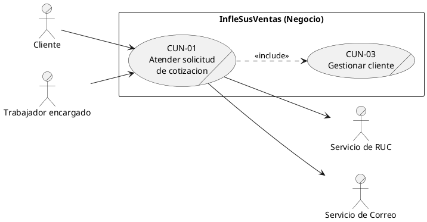

Figura 5. Caso de uso de negocio CUN-02 Cerrar venta con seguimiento

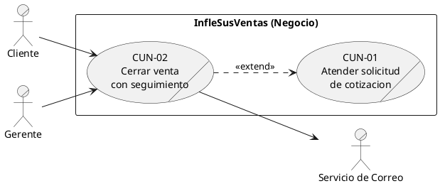

Figura 6. Caso de uso de negocio CUN-03 Gestionar cliente

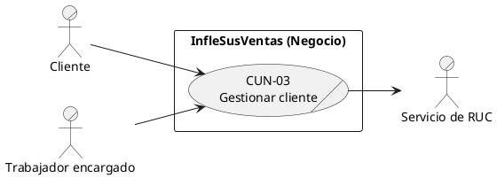

Figura 7. Caso de uso de negocio CUN-04 Gestionar cotizacion rapida

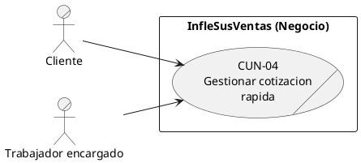

Figura 8. Caso de uso de negocio CUN-05 Administrar tarifas y parámetros

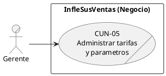

Figura 9. Realización del CU de negocio CUN-01 (actividad con carriles)

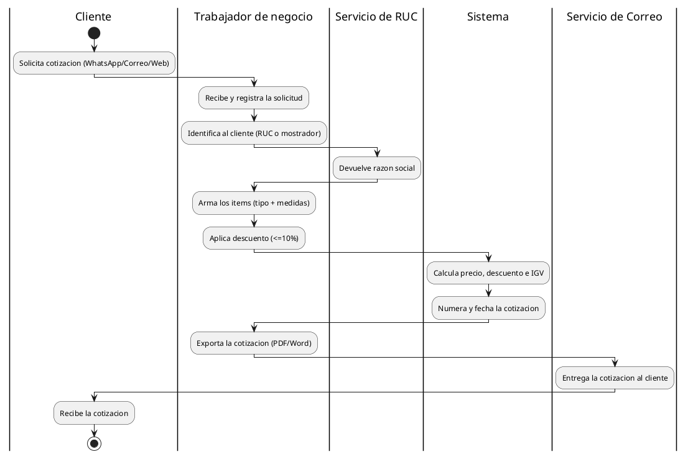

3.4.2 Diagramas de casos de uso del sistema - alta ceremonia (Must / MVP)

Un diagrama por cada caso de uso Must del MVP.

Figura 10. CU-01 Autenticarse

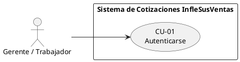

Figura 11. CU-02 Registrar y validar cliente

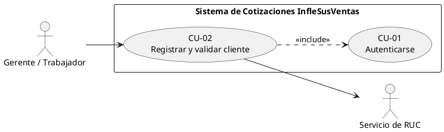

Figura 12. CU-03 Crear cotizacion

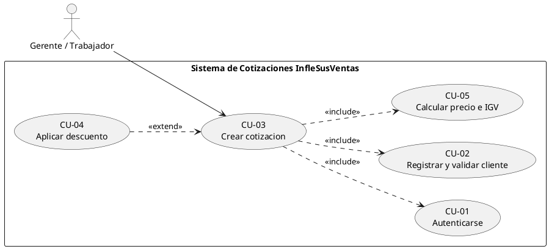

Figura 13. CU-04 Aplicar descuento

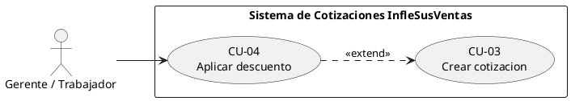

Figura 14. CU-05 Calcular precio e IGV

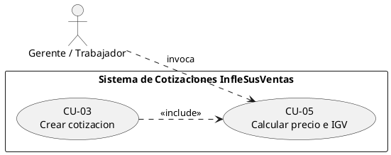

Figura 15. CU-06 Exportar cotizacion

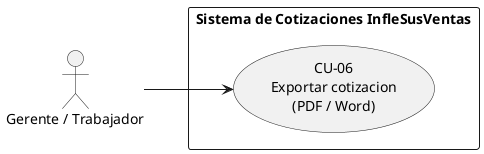

Figura 16. CU-07 Enviar cotización

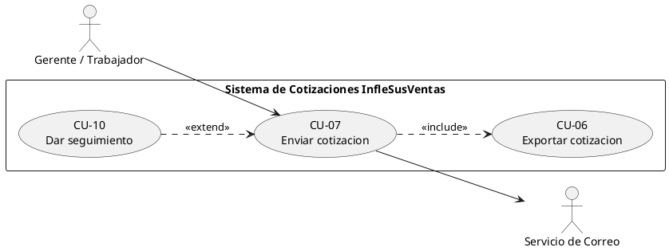

Figura 17. CU-08 Consultar historial y clientes

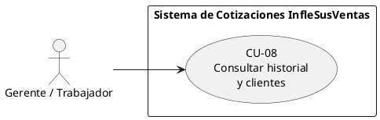

Figura 18. CU-11 Administrar tarifas y parámetros (caso de uso nuevo)

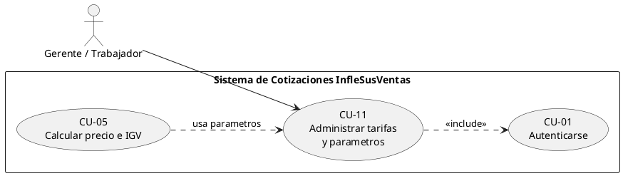

3.4.3 Diagramas de casos de uso del sistema - baja ceremonia (Should)

Casos de uso complementarios (Should), fuera del MVP.

Figura 19. CU-09 Cotizacion rapida

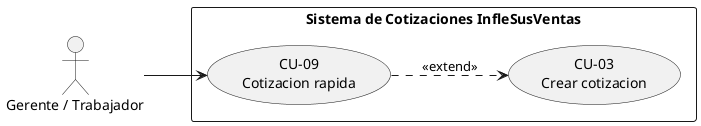

Figura 20. CU-10 Dar seguimiento

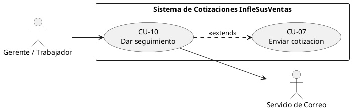

3.5 Diagrama de actividades (crear cotización con seguimiento)

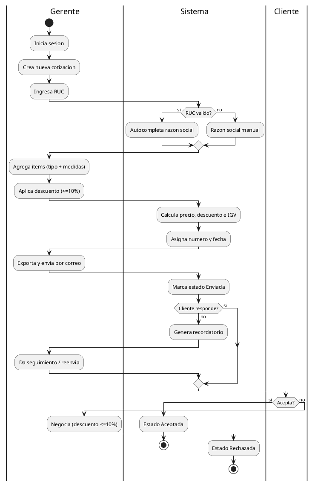

3.6 Diagrama de actividades (AS-IS)

```plantuml
@startuml
          |Cliente|
          start
          :Envia solicitud (WhatsApp/Correo/Web);
          |Gerente|
          :Revisa la solicitud manualmente;
          :Cotiza usando una plantilla;
          :Calcula precio e IGV a mano;
          :Genera y envia el PDF;
          |Cliente|
          :Recibe la cotizacion;
          if (Responde?) then (si)
            if (Acepta?) then (si)
              :Confirma compra;
              stop
            else (no)
              |Gerente|
              :Negocia descuento (<=10%);
              stop
            endif

          else (no)
           |Gerente|
           :Da seguimiento manual e insiste;
           stop
          endif
@enduml
```

3.7 Diagrama de secuencia (cotizar y enviar)

```plantuml
@startuml
          actor Gerente
          participant Sistema
          participant "Servicio RUC" as RUC
          participant "Servicio Correo" as Correo
          Gerente -> Sistema : iniciarSesion(usuario, clave)
          Sistema --> Gerente : sesion validada
          Gerente -> Sistema : ingresarRUC(ruc)
          Sistema -> RUC : validar(ruc)

   RUC --> Sistema : razonSocial / invalido
   Sistema --> Gerente : autocompleta razon social
   Gerente -> Sistema : agregarItems(tipo, medidas)
   Gerente -> Sistema : aplicarDescuento(pct<=10)
   Sistema -> Sistema : calcularPrecioDescuentoIGV()
   Sistema -> Sistema : asignarNumeroYFecha()
   Gerente -> Sistema : exportarYEnviar(correoCliente)
   Sistema -> Correo : enviar(cotizacion.pdf)
   Correo --> Sistema : ok
   Sistema --> Gerente : estado = Enviada
@enduml
```

3.7.1 Diagramas de secuencia complementarios

Figura 21. Secuencia CU-02 Validar RUC y autocompletar

```plantuml
@startuml
       actor "Gerente / Trabajador" as G
       participant Sistema

        participant "Servicio RUC" as RUC
        G -> Sistema : ingresarRUC(ruc)
        Sistema -> RUC : validar(ruc)
        alt Servicio disponible y RUC válido
         RUC --> Sistema : razonSocial
         Sistema --> G : autocompleta razon social (editable)
        else RUC invalido
         RUC --> Sistema : invalido
         Sistema --> G : solicitar razon social manual
        else Servicio no disponible
         RUC --> Sistema : timeout
         Sistema --> G : continuar manual (RNF-06)
        end
        G -> Sistema : guardarCliente(datos)
        Sistema --> G : cliente asociado a la cotizacion
@enduml
```

Figura 22. Secuencia CU-10 Dar seguimiento

```plantuml
@startuml
actor "Gerente / Trabajador" as G

participant Sistema
participant "Servicio Correo" as Correo
Sistema -> Sistema : detectar cotizacion sin respuesta (plazo)
Sistema -> Sistema : estado = En seguimiento
Sistema --> G : notificar recordatorio
G -> Sistema : reenviar(cotizacion, descuento<=10%)
Sistema -> Correo : enviar(cotizacion.pdf)
Correo --> Sistema : ok
Sistema -> Sistema : registrar interaccion (nota, descuento)
alt Cliente acepta
 G -> Sistema : marcarAceptada()
 Sistema --> G : estado = Aceptada
else Cliente rechaza
 G -> Sistema : marcarRechazada()
 Sistema --> G : estado = Rechazada
end
@enduml
```

3.8 Diagrama de clases del dominio

```plantuml
@startuml
                class Usuario {
                  +id
                  +usuario
                  +password
                  +rol
                }
                class Cliente {
                  +id
                  +ruc
                  +razonSocial
                  +correo

                }
                class Cotizacion {
                  +numero
                  +fecha
                  +tipo
                  +subtotal
                  +igv
                  +total
                  +estado
                }
                class Item {
                  +categoria
                  +medidas
                  +cantidad
                  +descripcion
                  +precioBase
                }
                class Descuento {
                  +porcentaje
                  +monto
                }
                class Seguimiento {
                  +fecha
                  +tipo
                  +nota
                }
                class Tarifa {
                  +categoria
                  +rangoTamano
                  +precioUnitario
                }
                Usuario "1" --> "*" Cotizacion : registra
                Cliente "1" --> "*" Cotizacion
                Cotizacion "1" *-- "*" Item
                Cotizacion "1" o-- "0..1" Descuento
                Cotizacion "1" o-- "*" Seguimiento
                Item ..> Tarifa : usa
@enduml
```

Validación de la semana: El equipo revisó los modelos en walkthrough; se acordó que el

cálculo de precio e IGV se modela como CU-05 incluido por CU-03.
