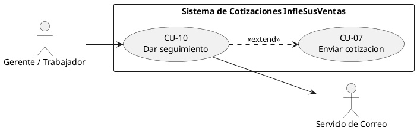
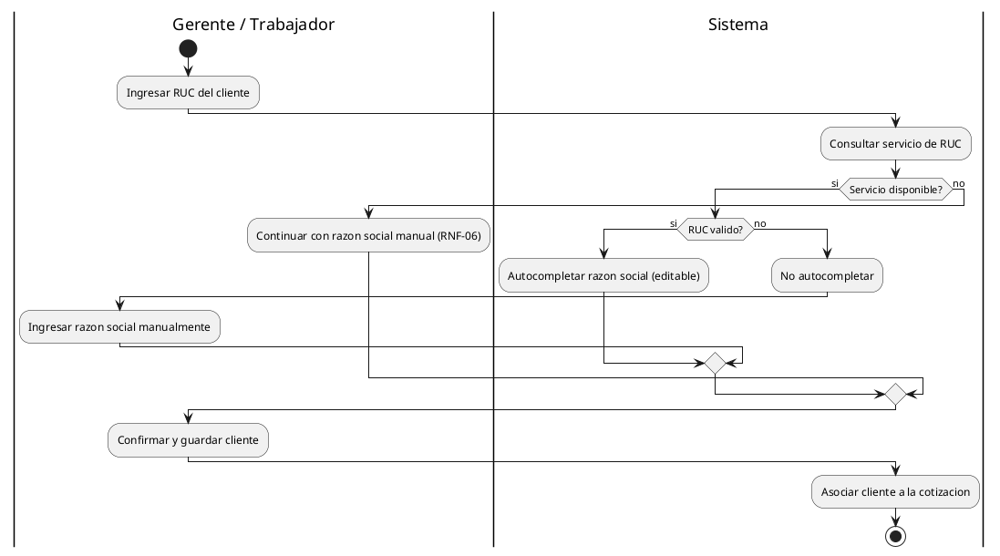
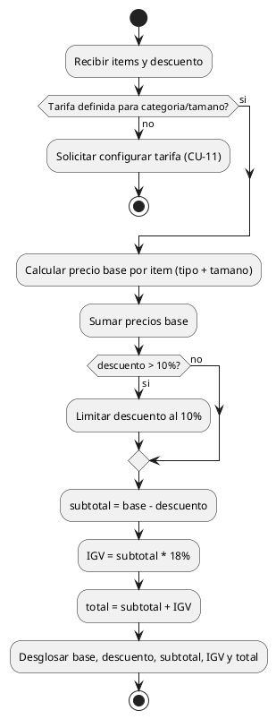
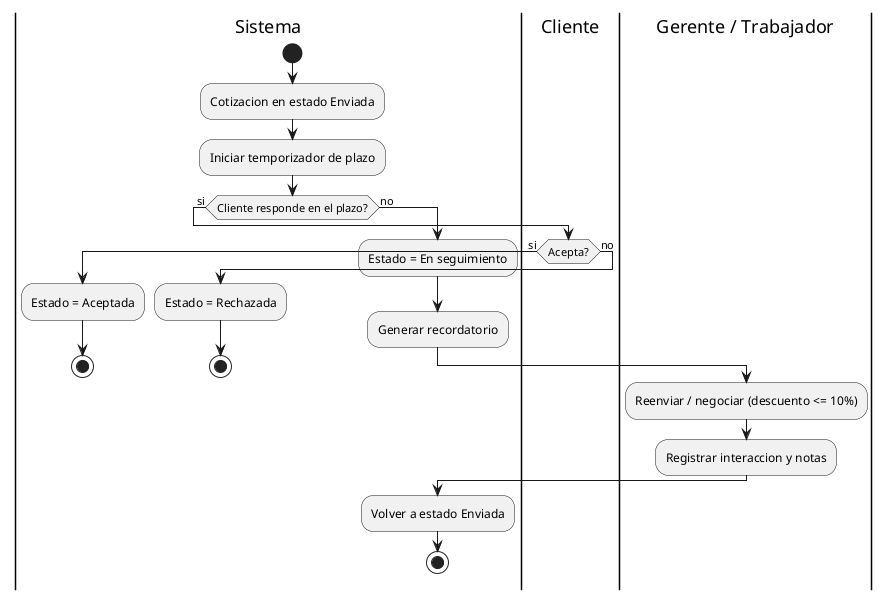

# 4. ESPECIFICACIÓN DE REQUISITOS (CASOS DE USO)

> **Semana 4** · Sistema de Gestión de Cotizaciones para InfleSusVentas
> Contenido extraído del documento del proyecto (fuente definitiva).

---

4.1 Objetivo de la semana

Documentar los casos de uso con la plantilla del curso (alta y baja ceremonia). El

entregable de desarrollo del proyecto corresponde a los requisitos de prioridad Must, por lo que

se especifican todos los casos de uso que cubren dichos requisitos.

4.2 Acta de reunion

Acta de reunión — Semana 4

Fecha / Hora             25/04/2026, 7:00 p.m.
Modalidad                Virtual
Asistentes               R1, R2, R3, R4
Objetivo del sprint      Especificar los casos de uso Must (alta y baja ceremonia).
Acuerdos y tareas        R3 redacta los CU de alta ceremonia (CU-02, CU-03, CU-05).
R2 redacta los CU breves (CU-01, CU-04, CU-06, CU-07, CU-08).
R4 revisa criterios de aceptacion.
Impedimentos             Ninguno.
Proxima reunion          01/05/2026

4.3 Casos de uso del entregable (Must, MVP) y su ceremonia

El entregable de desarrollo es el conjunto de requisitos Must, que constituyen el MVP y

se presentan en su totalidad. Por su importancia, todos los casos de uso Must se especifican en

alta ceremonia (fully-dressed). Los casos de uso Should (CU-09 y CU-10) son complementarios:

se documentan en baja ceremonia y no se implementaran en código en esta etapa.

CU     Nombre                          Requisitos que cubre             MoSCoW Ceremonia
CU-01 Autenticarse                      RF-46, RF-47                        Must        Alta
CU-02 Registrar y validar cliente       RF-01 a RF-06                       Must        Alta
CU-03 Crear cotizacion                  RF-08 a RF-16, RF-23 a RF-25        Must        Alta

CU-04 Aplicar descuento                  RF-44, RF-45                           Must      Alta
CU-05 Calcular precio e IGV              RF-17 a RF-21                          Must      Alta
CU-06 Exportar cotizacion                RF-26, RF-27                           Must      Alta
CU-07 Enviar cotizacion                  RF-28                                  Must      Alta
CU-08 Consultar historial y clientes     RF-30 a RF-33, RF-35, RF-36            Must      Alta
CU-11 Administrar        tarifas       y RF-18, RF-22, RNF-11                   Must      Alta
parámetros
CU-09 Cotizacion rapida                  RF-39 a RF-43                       Should       Baja
CU-10 Dar seguimiento                    RF-48 a RF-50                       Should       Baja

4.4 Casos de uso de alta ceremonia (Must - MVP)

Se especifican en detalle los nueve casos de uso Must que conforman el MVP. Cada uno

incluye actores, precondición, disparador, flujo principal, flujos alternativos, excepciones,

postcondición, reglas de negocio, criterio de aceptación y requisitos que cubre.

CU-01. Autenticarse

Actor principal          Gerente / Trabajador
Ceremonia                Alta
Prioridad                Must (MVP)
Precondicion             El usuario tiene credenciales registradas y activas
Disparador               El usuario abre el sistema e intenta ingresar
Flujo principal          1. El sistema muestra el formulario de inicio de sesión.
2. El usuario ingresa usuario y contrasena.
3. El sistema valida las credenciales.
4. El sistema abre la sesión y muestra la pantalla principal.
Flujos alternativos      2a. El usuario solicita mostrar u ocultar la contraseña.
Excepciones              3a. Credenciales inválidas: el sistema muestra un mensaje y solicita
reintento.
3b. Usuario inactivo: el sistema deniega el acceso.
Postcondicion            Sesión iniciada y validada; acceso habilitado
Reglas de negocio        RD-09 (uso exclusivo del usuario autorizado)

Criterio de aceptación Con credenciales validas se abre la sesion; con invalidas se deniega (0
accesos sin credencial, RNF-08)
Requisitos               RF-46, RF-47

CU-02. Registrar y validar cliente

Actor principal           Gerente / Trabajador
Actor secundario          Servicio de RUC
Ceremonia                 Alta
Prioridad                 Must (MVP)
Precondicion              Usuario autenticado
Disparador                El usuario ingresa el RUC del cliente
Flujo principal           1. El usuario ingresa el RUC.
2. El sistema consulta el servicio de RUC.
3. Si es valido, autocompleta la razon social (editable).
4. El usuario confirma y guarda el cliente.
Flujos alternativos       2a. RUC invalido: no autocompleta; el usuario ingresa la razon
social.
2b. Servicio no disponible: el usuario continua manualmente
(RNF-06).
Excepciones               El RUC tiene un formato incorrecto: el sistema lo indica y solicita
correccion.
Postcondicion             Cliente registrado y asociado a la cotizacion
Reglas de negocio         RD-09 (uso autorizado); la razon social siempre es editable
Criterio de aceptacion    Con un RUC valido se autocompleta la razon social en < 5 s
Requisitos                RF-01 a RF-06

CU-03. Crear cotizacion

Actor principal           Gerente / Trabajador
Ceremonia                 Alta
Prioridad                 Must (MVP)
Precondicion              Usuario autenticado y cliente identificado
Disparador                Pulsa Nueva Cotizacion

Flujo principal          1. Agrega items eligiendo categoria y medidas.
2. El sistema genera la descripcion automatica de los items estandar.
3. El sistema calcula el precio base (incluye CU-05).
4. El sistema asigna numero correlativo y fecha.
5. El usuario guarda la cotizacion.
Flujos alternativos      1a. Item 'Otros': la descripcion queda en blanco para edicion manual.
3a. El usuario aplica un descuento (extiende CU-04).
Excepciones              Faltan medidas obligatorias de la categoria: el sistema no permite
continuar.
Postcondicion            Cotizacion almacenada en el historial
Reglas de negocio        RD-01, RD-03, RD-04
Criterio de aceptacion   La cotizacion se guarda con numero unico, fecha e items validos
Requisitos               RF-08 a RF-16, RF-23 a RF-25

CU-04. Aplicar descuento

Actor principal          Gerente / Trabajador
Ceremonia                Alta
Prioridad                Must (MVP)
Precondicion             Existe una cotización en edición con al menos un item
Disparador               El usuario decide otorgar un descuento por cantidad
Flujo principal          1. El usuario indica el porcentaje de descuento.
2. El sistema valida el porcentaje contra el tope según la cantidad.
3. El sistema aplica el descuento al subtotal (invoca CU-05).
4. El sistema muestra el desglose actualizado.
Flujos alternativos      2a. Descuento sobre el tope: el sistema lo limita al 10%.
Excepciones              1a. Porcentaje no numérico o negativo: el sistema lo rechaza.
Postcondicion            Descuento aplicado (<=10%) y montos recalculados
Reglas de negocio        RD-08 (descuento <=10% según cantidad)
Criterio de aceptación   Un intento de 15% se limita a 10%; el total refleja el descuento
Requisitos               RF-44, RF-45

CU-05. Calcular precio e IGV

Actor principal          Sistema (invocado por el usuario)

Ceremonia                 Alta
Prioridad                 Must (MVP)
Precondicion              La cotización tiene al menos un ítem
Disparador                Cambio en ítems o en el descuento
Flujo principal           1. Calcula el precio base por ítem según tipo y tamaño.
2. Aplica el descuento (<=10% según cantidad) al total.
3. Obtiene el subtotal con descuento.
4. Aplica el IGV sobre el subtotal.
5. Desglosa precio base, descuento, subtotal, IGV y total.
Flujos alternativos       2a. Descuento sobre el tope: el sistema lo limita al 10%.
Excepciones               Tarifa no definida para la categoría/tamaño: se solicita configurarla
(CU-11).
Postcondicion             Montos calculados y desglosados
Reglas de negocio         RD-02 (IGV sobre subtotal con descuento), RD-08 (tope 10%)
Criterio de aceptacion    Con base 1000 y 10% de descuento, total = 1062 (IGV 18%)
Requisitos                RF-17 a RF-21

CU-06. Exportar cotizacion

Actor principal           Gerente / Trabajador
Ceremonia                 Alta
Prioridad                 Must (MVP)
Precondicion              Existe una cotización guardada con número y fecha
Disparador                El usuario elige exportar la cotizacion
Flujo principal           1. El usuario selecciona el formato (PDF o Word).
2. El sistema genera el documento con el desglose (precio,
descuento, IGV, total).
3. El sistema entrega el archivo para su descarga.
Flujos alternativos       1a. El usuario exporta en ambos formatos.
Excepciones               2a. Error al generar el archivo: el sistema muestra un mensaje y
permite reintentar.
Postcondicion             Documento PDF/Word generado y disponible
Reglas de negocio         El desglose sigue RD-02 (IGV sobre subtotal con descuento)
Criterio de aceptacion    El archivo se genera en < 10 s (RNF-05) con el desglose correcto

Requisitos                RF-26, RF-27

CU-07. Enviar cotizacion

Actor principal            Gerente / Trabajador
Actor secundario           Servicio de Correo
Ceremonia                  Alta
Prioridad                  Must (MVP)
Precondicion               Existe una cotización exportable
Disparador                 El usuario decide enviar la cotización al cliente
Flujo principal            1. El usuario ingresa o confirma el correo del cliente.
2. El sistema adjunta la cotización (incluye CU-06).
3. El sistema envía el correo mediante el servicio de correo.
4. El sistema registra el estado 'Enviada'.
Flujos alternativos        4a. El usuario reenvia una cotización ya enviada (puede
extenderse a CU-10).
Excepciones                1a. Correo con formato invalido: el sistema lo indica y no envia.
3a. Fallo del servicio de correo: no marca como enviada y permite
reintentar.
Postcondicion              Cotización enviada y estado registrado
Reglas de negocio          RD-10 (si no hay respuesta, pasa a seguimiento)
Criterio de aceptacion     Con un correo valido se envía y el estado cambia a 'Enviada'; con
invalido no se envia
Requisitos                 RF-28 (y RF-29 registro de estado, Should)

CU-08. Consultar historial y clientes

Actor principal            Gerente / Trabajador
Ceremonia                  Alta
Prioridad                  Must (MVP)
Precondicion               Existen cotizaciones o clientes registrados
Disparador                 El usuario abre el historial desde la barra lateral
Flujo principal            1. El usuario abre el historial o la lista de clientes.
2. El sistema muestra las cotizaciones con numero, cliente, fecha y
estado.

3. El usuario filtra o busca por numero, cliente o fecha.
4. El usuario abre una cotización para consultarla.
Flujos alternativos        3a. Sin resultados: el sistema muestra un aviso.
4a. El usuario reabre o duplica una cotizacion (RF-37, RF-38).
Excepciones                Sin excepciones críticas.
Postcondicion              Información consultada; sin cambios en los datos
Reglas de negocio          RD-01 (la numeración única facilita la busqueda)
Criterio de aceptacion     El historial lista todas las cotizaciones y permite abrir cualquiera
por su numero
Requisitos                 RF-30 a RF-33, RF-35, RF-36

CU-11. Administrar tarifas y parámetros

Actor principal            Gerente
Ceremonia                  Alta
Prioridad                  Must (MVP)
Precondicion               Usuario autenticado (incluye CU-01)
Disparador                 El gerente accede a la configuración del sistema
Flujo principal            1. El gerente abre la configuración.
2. Edita las tarifas por categoría y rango de tamaño.
3. Configura el % de IGV, el tope de descuento, el correlativo
inicial y el plazo de recordatorio.
4. El sistema valida y guarda los parámetros.
Flujos alternativos        2a. Alta de una nueva tarifa para una categoría/tamaño sin tarifa.
Excepciones                4a. Valor invalido (por ejemplo, IGV negativo): el sistema lo
rechaza.
Postcondicion              Parámetros y tarifas actualizados; disponibles para CU-05
Reglas de negocio          RD-07 (tarifas por tipo+tamaño, parametrizables), RD-02, RD-08
Criterio de aceptación     Cambiar una tarifa o el % de IGV se refleja en el siguiente cálculo
sin recompilar (RNF-11, <= 5 min)
Requisitos                 RF-18, RF-22, RNF-11

4.4.1 Diagramas de actividad complementarios

Diagramas de actividad de apoyo para los casos de uso Must con lógica interna relevante.

Figura 23. Actividad CU-02 Registrar y validar cliente

Figura 24. Actividad CU-05 Calcular precio e IGV

Figura 25. Actividad CU-10 Dar seguimiento

4.5 Casos de uso de baja ceremonia (Should - complementario)

Casos de uso de prioridad Should. Son complementarios al MVP, se describen de forma

breve y no se implementarán en código en esta etapa.

CU          Objetivo                  Flujo resumido            Prioridad      Requisitos
CU-09 Cotizar rápido sin Registra items sin validar RUC;           Should     RF-39 a RF-43
RUC (mostrador) fecha por mes; almacena por
separado
CU-10 Recuperar ventas Marca 'En seguimiento', genera              Should     RF-48 a RF-50
sin respuesta    recordatorio y permite reenviar o
negociar

Validación de la semana: El Gerente validó los flujos de los casos de uso Must (MVP)

con datos reales de ejemplo; los criterios de aceptacion se consideraron demostrables. Se

confirmo que el MVP a presentar corresponde a la totalidad de los requisitos Must.
