# 8. REQUISITOS DE DOMINIO

> **Semana 9** · Sistema de Gestión de Cotizaciones para InfleSusVentas
> Contenido extraído del documento del proyecto (fuente definitiva).

---

8.1 Objetivo de la semana

Capturar las reglas de negocio, el modelo de datos y el ciclo de vida de la cotización,

independientes de la tecnología.

8.2 Acta de reunion

Acta de reunión — Semana 9

Fecha / Hora             29/05/2026, 7:00 p.m.
Modalidad                Virtual
Asistentes               R1, R2, R3, R4
Objetivo del sprint      Definir reglas de dominio, entidades y ER.
Acuerdos y tareas        R2 redacta las reglas RD.
R3 elabora el diagrama entidad-relación y de estados.
Impedimentos             Definir el factor de proporción del globo.
Proxima reunion          06/06/2026

8.3 Reglas de negocio (RD)

ID       Regla de negocio                                      Entidad
RD-01      Numero de cotizacion         unico,   correlativo   e Cotizacion
irrepetible (desde 1001)
RD-02      El IGV se calcula sobre el subtotal ya con descuento Cotizacion
RD-03      Las medidas obligatorias dependen de la categoría Item
del ítem
RD-04      Descripción automática de ítems estándar; 'Otros' en Item
blanco
RD-05      En cotizacion rapida la fecha guarda solo mes/año y Cotizacion rapida
no valida RUC
RD-06      En globos el diámetro se deriva de la altura por un Item (globo)
factor

RD-07     Las tarifas dependen de tipo + tamaño y son Tarifa
parametrizables
RD-08     El descuento no supera el 10% y depende de la Cotización/Descuento
cantidad
RD-09     Uso exclusivo del usuario autorizado (autenticado)   Usuario
RD-10     Cotización sin respuesta pasa a En seguimiento y Cotización/Seguimiento
genera recordatorios

8.3.1 Diagramas de reglas de negocio

Las reglas de negocio de la sección 9.3 se representan como diagramas de actividad y

decisión.

Figura 26. RD-01 Numero unico, correlativo e irrepetible (desde 1001)

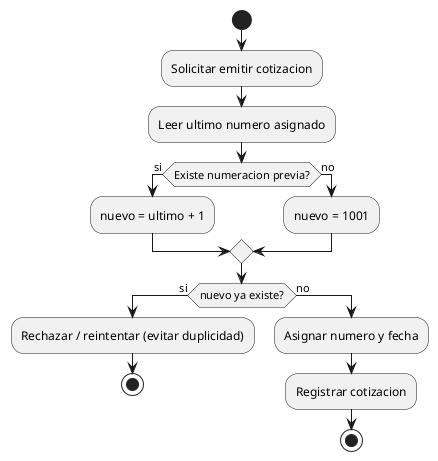

Figura 27. RD-02 El IGV se calcula sobre el subtotal ya con descuento

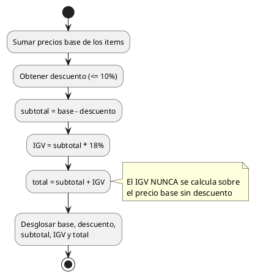

Figura 28. RD-03 Las medidas obligatorias dependen de la categoria del item

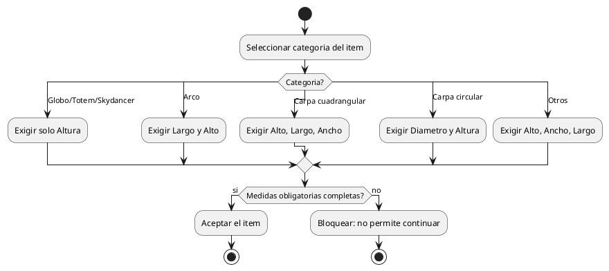

Figura 29. RD-04 Descripcion automatica de items estandar; 'Otros' en blanco

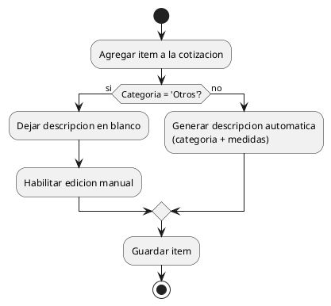

Figura 30. RD-05 En cotizacion rapida la fecha guarda solo mes/ano y no valida

RUC

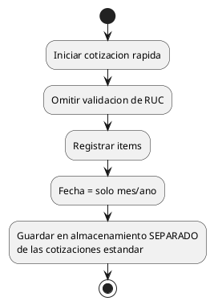

Figura 31. RD-06 En globos el diametro se deriva de la altura por un factor

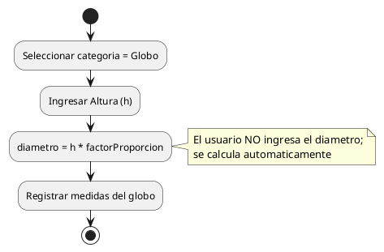

Figura 32. RD-07 Las tarifas dependen de tipo + tamano y son parametrizables

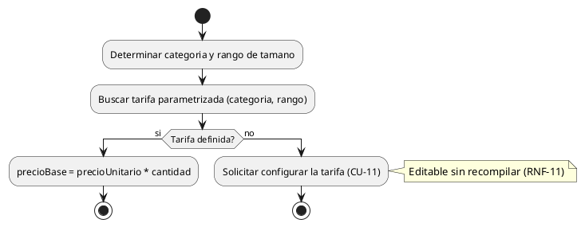

Figura 33. RD-08 El descuento no supera el 10% y depende de la cantidad

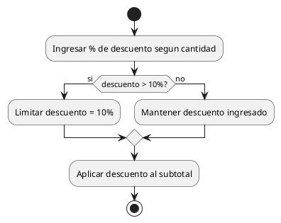

Figura 34. RD-09 Uso exclusivo del usuario autorizado (autenticado)

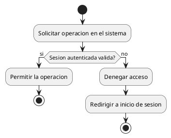

Figura 35. RD-10 Cotizacion sin respuesta pasa a En seguimiento y genera

recordatorios

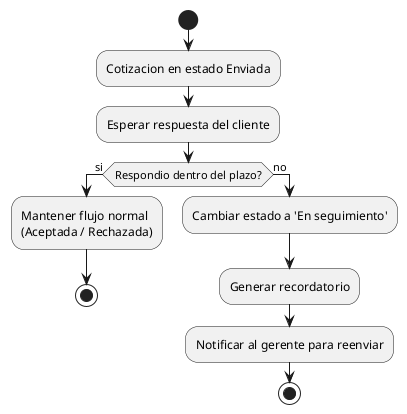

8.4 Logica de medidas por categoria

Producto                  Medidas requeridas             Descripcion automatica
Globo                    Solo altura (diametro por proporcion)             Si
Arco                     Largo y alto                                      Si
Carpa cuadrangular       Alto, largo, ancho                                Si

Carpa circular        Diametro y altura                                         Si
Totem                 Solo altura                                               Si
Skydancer             Solo altura                                               Si
Otros                 Alto, ancho, largo                                  No (en blanco)

8.5 Entidades del dominio

Entidad          Atributos clave
Usuario          id, usuario, password (hash), nombre, rol, activo
Cliente          id, RUC, razon social, correo, telefono
Cotizacion       numero, fecha, tipo, descuento %, subtotal, IGV, total, estado
Item             id, cotizacion, categoria, subtipo, medidas, cantidad, descripcion, precio base
Descuento        id, cotizacion, cantidad, porcentaje (<=10%), monto
Seguimiento      id, cotizacion, fecha, tipo, nota, descuento propuesto
Tarifa           categoria, rango de tamano, precio unitario
Configuracion    % IGV, correlativo inicial, tope de descuento, plazo de recordatorio

8.6 Diagrama entidad-relacion

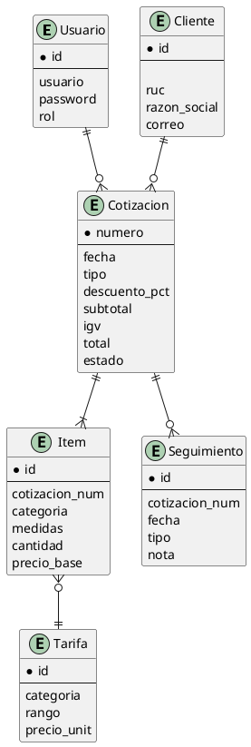

8.7 Diagrama de estados (ciclo de vida de la cotización)

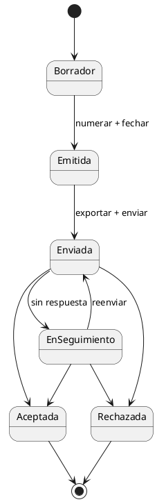

Validación de la semana: El Gerente confirmó las reglas de dominio; queda pendiente

definir el factor de proporción del globo antes de la construcción.
