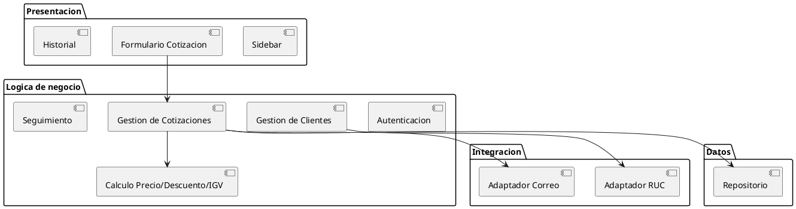
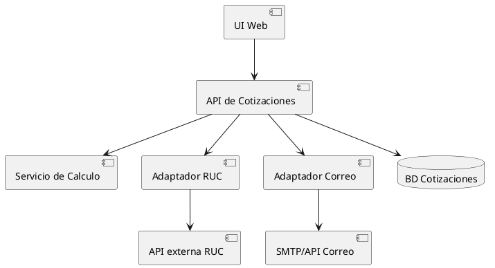
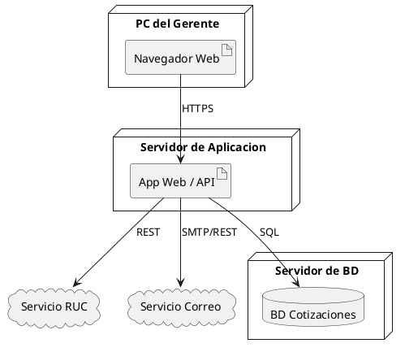

# 9. REQUISITOS DE DESARROLLO Y ARQUITECTURA

> **Semana 10** · Sistema de Gestión de Cotizaciones para InfleSusVentas
> Contenido extraído del documento del proyecto (fuente definitiva).

---

9.1 Objetivo de la semana

Definir como se construirá el sistema (entorno, proceso, estándares) y la arquitectura en

diagramas PlantUML de paquetes, componentes y despliegue.

9.2 Acta de reunion

Acta de reunión — Semana 10

Fecha / Hora          06/06/2026, 7:00 p.m.
Modalidad             Virtual
Asistentes            R1, R2, R3, R4
Objetivo del sprint   Definir requisitos de desarrollo y arquitectura.
Acuerdos y tareas     R3 define stack y arquitectura.
R1 define metodología y control de versiones.
R4 fija cobertura de pruebas.
Impedimentos          Ninguno.
Proxima reunion       13/06/2026

9.3 Requisitos de desarrollo

Fase                   Requisito               Detalle
Identificacion         Control de versiones    Git + GitHub
Especificacion         Stack tecnologico       Aplicacion web (frontend + backend + BD
relacional)
Especificacion         Entorno                 Navegador web; despliegue local o en nube
Especificacion         Metodologia             Incremental    RUP    + Scrum ligero (sprint
semanal)
Verificacion           Cobertura de pruebas >=   70%     en la logica             de    calculo
(IGV/descuento/medidas)
Gestion de cambios     Proceso RFC/CCB         Ver Semana 12

9.4 Diagrama de paquetes

9.5 Diagrama de componentes

9.6 Diagrama de despliegue

Validación de la semana: El equipo aprobó la arquitectura y los estándares de

desarrollo.
