# Especificación de Requisitos de Software (SRS)
## Sistema de Gestión de Cotizaciones para InfleSusVentas

**Curso:** Ingeniería de Requisitos · **Docente:** Ciro Rodríguez Rodríguez · **Grupo 6** · UNMSM (2026)

> Documento ensamblado a partir de la fuente definitiva del proyecto.

---


## 1. CONCEPTOS FUNDAMENTALES: ENCUADRE DEL PROBLEMA

1.1 Objetivo de la semana

Definir el problema, el objetivo, el alcance y el modelo de proceso del sistema de

cotizaciones de InfleSusVentas, distinguiendo el espacio del problema del espacio de la solución.

1.2 Acta de reunion

Acta de reunión — Semana 1

Fecha / Hora            04/04/2026, 7:00 p.m.
Modalidad               Virtual (videollamada)
Asistentes              R1 (lider), R2 (elicitacion), R3 (modelado), R4 (QA); reunion inicial
con el Gerente
Objetivo del sprint     Encuadrar el problema y definir la ficha del proyecto.
Acuerdos y tareas       R1 redacta la ficha del proyecto y objetivos.
R2 prepara el guión de la entrevista.
R3 elabora el diagrama de contexto (AS-IS/TO-BE).
R4 recopila restricciones y limitaciones.
Impedimentos            Las tarifas exactas por tipo/tamaño aún no están definidas.
Próxima reunion         11/04/2026

1.3 Contexto del negocio y situación actual (AS-IS)

InfleSusVentas fabrica y vende inflables publicitarios (globos, arcos, carpas, totems,

skydancers y formas personalizadas). Hoy gestiona sus cotizaciones de forma completamente

manual: las solicitudes llegan por WhatsApp, correo Yahoo y un formulario web que redirige a

WhatsApp; el gerente cotiza con una plantilla, calcula el precio y el IGV a mano, genera un PDF

y lo envia, sin un seguimiento sistemático.

1.4 Enunciado del problema

La gestión de cotizaciones es completamente manual, lo que genera lentitud, errores de

cálculo de precios e IGV, ausencia de numeración y fechado automáticos, falta de historial

centralizado y ausencia de seguimiento, por lo que muchas cotizaciones sin respuesta se enfrían

y se pierden ventas.

1.5 Necesidades de negocio y puntos de dolor

ID        Necesidad de negocio                                                     Dolor origen
RN-01       Agilizar y centralizar la generación de cotizaciones                            D1
RN-02       Calcular precios, descuento e IGV automaticamente                               D2
RN-03       Numerar y fechar automáticamente                                                D3
RN-04       Historial unico de cotizaciones y clientes                                      D4
RN-05       Validar RUC y autocompletar razón social                                        D5
RN-06       Exportar (PDF/Word) y enviar la cotización                                      D6
RN-07       Ofrecer cotizacion rapida                                                       D1
RN-08       Dar seguimiento para cerrar más ventas                                          D7

ID     Dolor actual                                      Consecuencia
D1     Cotizacion manual con plantilla                   Lento; el cliente puede irse a la
competencia
D2     Cálculo manual de precio e IGV                    Errores e inconsistencias
D3     Sin numeración ni fecha automáticas               Control y trazabilidad difíciles
D4     Informacion dispersa (WhatsApp/Yahoo/web) Sin historial único
D5     Sin validación de RUC                             Razón social a mano, con errores
D6     Envío manual del PDF                              Sin registro de envío
D7     Sin seguimiento sistemático                       Se enfrían las cotizaciones; se pierden
ventas

1.6 Objetivos

Objetivo general: elaborar la SRS del sistema de cotizaciones de InfleSusVentas

aplicando el proceso de Ingeniería de Requisitos, con requisitos trazables y validados.

- Encuadrar el problema (contexto, objetivos, alcance y modelo de proceso).

- Elicitar necesidades con múltiples técnicas y escenarios.

- Construir los catalogos completos de requisitos.

- Modelar el sistema con UML y priorizar con MoSCoW, Kano y Valor/Costo.

- Gestionar cambios, trazar y validar los requisitos.

1.7 Alcance y restricciones

Dentro del alcance: acceso autenticado; clientes con validación de RUC; catálogo con

lógica de medidas; precio, descuento (máx 10% por cantidad) e IGV; numeración, fecha,

exportacion, envio, historial, cotizacion rapida y seguimiento. Fuera del alcance: captura

automática de canales, facturación, inventario, pagos y multi-rol.

ID          Tipo      Restriccion
RES-01        Fiscal     IGV 18% configurable
RES-02       Negocio     Tarifas por definir; arquitectura parametrizable
RES-03       Tecnica     Depende de servicios externos de RUC y correo
RES-04      Operativa    El sistema no controla los canales de entrada
RES-05     Académica     Alcance limitado a especificación y prototipo
RES-06      Tiempo     El desarrollo se ajusta al ciclo del curso
1.8 Modelo de proceso de software

Se adopta un modelo Incremental basado en RUP (iterativo e incremental) con

ceremonias ágiles ligeras. RUP aporta fases (Inicio, Elaboración, Construcción, Transición),

documentación y trazabilidad; los incrementos permiten entregar valor de forma progresiva. Se

descartaron cascada (rígido), espiral (alto riesgo) y un enfoque puramente ágil (el dominio ya

está bastante definido).

1.9 Flujo de negocio (BPMN AS-IS y TO-BE)

Figura 1. Proceso manual de cotizacion (AS-IS).

Figura 2. Proceso de cotización con el sistema (TO-BE).
Ambos flujos son reproducibles en PlantUML (ver los diagramas de actividades de la

Semana 3).

Validación de la semana: El Gerente revisó la ficha del proyecto y confirmó el

problema, el alcance y los objetivos; se aprobó el encuadre y el modelo de proceso.

## 2. ELICITACIÓN DE REQUISITOS

2.1 Objetivo de la semana

Recoger las necesidades reales con al menos tres técnicas (entrevista, cuestionario,

análisis de documentos y observación) y traducirlas a requisitos, usando escenarios para

descubrir flujos y excepciones.

2.2 Acta de reunion

Acta de reunión — Semana 2

Fecha / Hora             11/04/2026, 7:00 p.m.
Modalidad                Presencial en la empresa
Asistentes               R1, R2, R3, R4; Gerente y Trabajador encargado
Objetivo del sprint      Elicitar requisitos y aplicar los instrumentos.
Acuerdos y tareas        R2 entrevista al Gerente y al Trabajador encargado.
R2 aplica el cuestionario a 20 clientes.
R4 tabula resultados y arma la tabla necesidad-requisito.
R3 define los escenarios.
Impedimentos             Disponibilidad limitada de clientes para el cuestionario.
Próxima reunión          18/04/2026

2.3 Análisis de stakeholders

Stakeholder     Tipo                   Interés                                  Poder   Interés
Gerente         Usuario principal / Cotizar rápido y cerrar ventas               Alto    Alto
Sponsor
Trabajador      Usuario secundario     Atender cotizaciones                     Medio    Alto
encargado
Cliente         Actor externo          Cotización clara y rápida por correo      Bajo    Alto
Servicio     de Sistema externo        Disponibilidad de la API                  Bajo    Bajo
RUC
Servicio     de Sistema externo        Entrega del envio                         Bajo    Bajo
correo

2.4 Guión de entrevista aplicado

Pregunta                                                            Objetivo            Tipo
Cuénteme paso a paso cómo cotiza hoy                                Flujo as-is        Abierta
¿Cuántas cotizaciones emite por semana?                             Volumen            Cerrada
¿Qué regla usa para el precio de cada tipo?                         Regla de negocio   Cerrada
¿Hasta que % de descuento otorga y según que?                       Descuento          Cerrada
¿Qué hace cuando el cliente no responde?                            Seguimiento        Abierta
¿Quién debe poder usar el sistema?                                  Acceso/seguridad   Cerrada
¿Qué es lo que más le molesta del proceso actual?                   Dolor              Abierta

2.5 Entrevistas (testimonios)

Entrevista 1 - Gerente. “Yo mismo cotizo todo. Uso una plantilla, calculo el precio según

el tipo y el tamaño, y le sumo el IGV a mano; a veces me equivoco. Número a ojo y después no

sé cuántas hice. Lo que más me duele es que mando la cotización y el cliente no responde; me

olvido de insistir y ahí se pierde la venta. Cuando compra harto le doy un descuento, pero nunca

más del 10%.”

Ideas clave: cotización manual; IGV con errores; sin numeración ni historial;

seguimiento que se olvida; descuento por cantidad con tope del 10%.

Entrevista 2 - Trabajador encargado. “A veces atiendo cuando el gerente no está.

Necesitaría entrar con mi usuario, porque no es bueno que cualquiera vea los precios. Lo más

tedioso es escribir la razón social; si pudiera poner el RUC y que salga solo, ahorraría tiempo.

También quisiera reenviar la cotización y saber si el cliente respondió.”

Ideas clave: acceso con usuario; autocompletar por RUC; reenvío y estado.

Entrevista 3 - Cliente frecuente. “Pido arcos y sky dancers para campanas. Quiero la

cotización rápido y clara, con el IGV separado, y por correo. Si se demoran, cotizo con otro. Y si

pido varias unidades, espero un descuento.”

Ideas clave: rapidez; IGV desglosado; envío por correo; competencia; descuento por

cantidad.

2.6 Cuestionario aplicado (preguntas y respuestas)

Se aplicó a 20 clientes frecuentes. A continuación las preguntas realizadas y la

distribución de respuestas.

N.    Pregunta realizada                              Respuestas (distribucion)
1     ¿Por qué canal suele recibir su cotización?     WhatsApp 80% / Correo 15% / Otro 5%
2     ¿Cómo preferiría recibirla?                     Correo en PDF 70% / WhatsApp 25% /
Impreso 5%
3     ¿Qué tan importante es la rapidez de Muy importante 65% / Importante 30% /
respuesta?                           Poco 5%
4     ¿Ha pedido descuento por comprar varias Si 55% / No 45%
unidades?
5     Tras una cotización sin comprar, le dieron No 60% / Si 40%
seguimiento?
6     ¿Le gustaría ver el IGV desglosado?             Si 75% / Indiferente 25%
7     ¿Qué inflables suele solicitar?                 Arcos 35% / Globos 25% / Sky dancers
20% / Carpas 15% / Otros 5%

Conclusión: se requiere agilizar y digitalizar la entrega, desglosar el IGV, dar seguimiento

para no perder ventas y soportar descuentos por cantidad con tope.

2.7 Escenarios de elicitación (ficticios)

Escenario 1 - Cotización estándar urgente. 'Publicidad Total S.A.C.' pide por WhatsApp 3

arcos de 6 x 4 m para una campana en dos días. El trabajador inicia sesión, ingresa el RUC (se

autocompleta la razón social), agrega los arcos, aplica 8% de descuento por cantidad, el sistema

calcula el IGV, asigna el número 1001 y la fecha, exporta el PDF y lo envía. (RF-46, RF-01 a

RF-05, RF-08 a RF-16, RF-44/45, RF-17 a RF-28.)

Escenario 2 - Seguimiento para cerrar la venta. Tres días después la cotización 1001 sigue

sin respuesta; el sistema marca 'En seguimiento' y genera un recordatorio; el gerente reenvía con

10% de descuento y registra la negociación; el cliente acepta. (RF-48 a RF-50, RF-44/45,

RD-10.)

Escenario 3 - Cotización rápida sin RUC. Un cliente de mostrador pide el precio de un

globo de 3 m; se usa la cotización rápida, sin validar RUC, con fecha por mes y almacenamiento

separado. (RF-39 a RF-43.)

Escenario 4 - Servicio de RUC no disponible. El servicio de RUC no responde; el sistema

permite continuar ingresando la razón social manualmente. (RF-04, RNF-06.)

Escenario 5 - Carpa e inflable personalizado. Se pide una carpa cuadrangular 5 x 5 x 3 m

y un inflable con forma de mascota ('Otros'), cuya descripción queda en blanco para completar.

(RF-12, RF-14, RF-16.)

2.8 Necesidad -> Requisito -> Caso de uso

Actor           Necesidad (voz del usuario)                   Requisito                   CU
Gerente      Que el precio y el IGV se Calcular precio, descuento e IGV                 CU-05
calculen solos
Trabajador Entrar con mi usuario                Autenticar al usuario autorizado        CU-01
Trabajador Poner el RUC y que salga la Validar RUC y autocompletar                      CU-02
razón social
Gerente      Dar descuento, pero no más del Aplicar descuento con tope de 10%           CU-04
10%

Gerente      Que no se pierda la venta si no Dar    seguimiento        (estado   +    CU-10
responden                       recordatorio)
Cliente      Recibirla rápido y por correo     Exportar (PDF/Word) y enviar por CU-06/07
correo

Validación de la semana: El Gerente y el Trabajador validaron las ideas clave y la tabla

necesidad-requisito; se confirmó el tope de descuento del 10% y la necesidad de seguimiento.

## 3. ANÁLISIS Y MODELADO (UML)

3.1 Objetivo de la semana

Representar los requisitos con modelos UML (casos de uso, actividad, secuencia y clases)

para facilitar la comprensión y detectar errores. Todos los diagramas se expresan en PlantUML.

3.2 Acta de reunion

Acta de reunión — Semana 3

Fecha / Hora           18/04/2026, 7:00 p.m.
Modalidad              Virtual
Asistentes             R1, R2, R3, R4
Objetivo del sprint    Construir los modelos UML del sistema.
Acuerdos y tareas      R3 elabora el DCU y el diagrama de clases.
R3 elabora actividad y secuencia.
R2 verifica actores y relaciones include/extend.
Impedimentos           Definir si el cálculo es un CU propio o incluido.
Próxima reunión        25/04/2026

3.3 Actores y objetivos

Actor                  Descripción                                        Principal/Secundario
Gerente / Trabajador Usuario autenticado que opera el sistema             Principal
Servicio de RUC        Valida el RUC y devuelve la razón social           Secundario
Servicio de Correo     Entrega la cotización al cliente                   Secundario

3.4 Diagrama de casos de uso

```plantuml
@startuml                                                       G --> UC1
left to right direction                                         G --> UC2
actor "Gerente / Trabajador" as G                               G --> UC3
actor "Servicio de RUC" as RUC                                  G --> UC6
actor "Servicio de Correo" as MAIL                              G --> UC7
rectangle "Sistema de Cotizaciones InfleSusVentas" {            G --> UC8
  usecase "CU-01 Autenticarse" as UC1                           G --> UC9
  usecase "CU-02 Registrar y validar cliente" as UC2            G --> UC10
  usecase "CU-03 Crear cotizacion" as UC3                       UC2 ..> UC1 : <<include>>
  usecase "CU-04 Aplicar descuento" as UC4                      UC3 ..> UC1 : <<include>>
  usecase "CU-05 Calcular precio e IGV" as UC5                  UC3 ..> UC2 : <<include>>
  usecase "CU-06 Exportar cotizacion" as UC6                    UC3 ..> UC5 : <<include>>
  usecase "CU-07 Enviar cotizacion" as UC7                      UC3 ..> UC4 : <<extend>>
  usecase "CU-08 Consultar historial" as UC8                    UC9 ..> UC3 : <<extend>>
  usecase "CU-09 Cotizacion rapida" as UC9                      UC7 ..> UC10 : <<extend>>
  usecase "CU-10 Dar seguimiento" as UC10                       UC2 --> RUC
}                                                               UC7 --> MAIL
@enduml
```

3.4.1 Modelo de casos de uso del negocio

Además del diagrama de casos de uso del sistema, se modela el negocio según la

disciplina de modelado del negocio del Proceso Unificado: actores de negocio (Cliente, Servicio

de RUC y Servicio de Correo), trabajadores de negocio (Gerente y Trabajador encargado) y

casos de uso de negocio (CUN-01 a CUN-05). Al dibujar a mano, los actores y trabajadores de

negocio llevan una raya sobre la cabeza y los casos de uso de negocio una raya dentro de la

elipse.

Figura 3. Modelo de casos de uso del negocio de InfleSusVentas

```plantuml
@startuml                                                        ' Relaciones
left to right direction                                          Cli --> N1
skinparam packageStyle rectangle                                 Cli --> N2
actor/ "Cliente" as Cli                                          Cli --> N4
actor/ "Servicio de RUC (SUNAT)" as RUC                          N1 ..> N3 : <<include>>
actor/ "Servicio de Correo" as Mail                              N2 ..> N1 : <<extend>>
actor/ "Gerente" as Ger                                          N1 --> RUC
actor/ "Trabajador encargado" as Trab                            N1 --> Mail
rectangle "InfleSusVentas (Negocio)" {                           N2 --> Mail
  usecase/ "CUN-01\nAtender solicitud\nde cotizacion" as N1      Ger --> N2
  usecase/ "CUN-02\nCerrar venta\ncon seguimiento" as N2         Ger --> N5
  usecase/ "CUN-03\nGestionar cliente" as N3                     Trab --> N1
  usecase/ "CUN-04\nGestionar cotizacion\nrapida" as N4          Trab --> N3
usecase/ "CUN-05\nAdministrar tarifas\ny parametros" as N5     @enduml
```

}

Figura 4. Caso de uso de negocio CUN-01 Atender solicitud de cotización

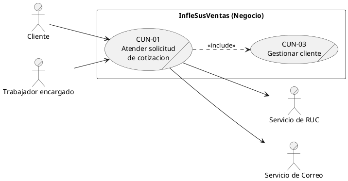

Figura 5. Caso de uso de negocio CUN-02 Cerrar venta con seguimiento

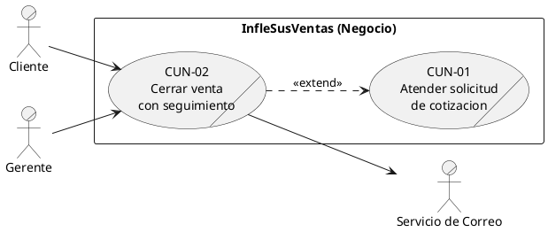

Figura 6. Caso de uso de negocio CUN-03 Gestionar cliente

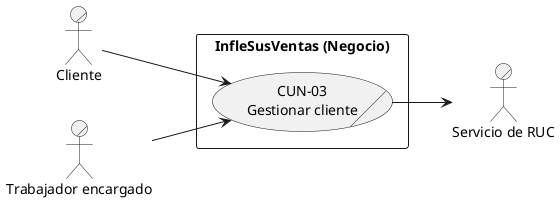

Figura 7. Caso de uso de negocio CUN-04 Gestionar cotizacion rapida

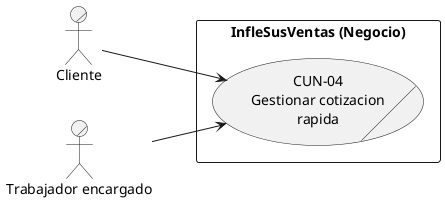

Figura 8. Caso de uso de negocio CUN-05 Administrar tarifas y parámetros

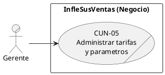

Figura 9. Realización del CU de negocio CUN-01 (actividad con carriles)

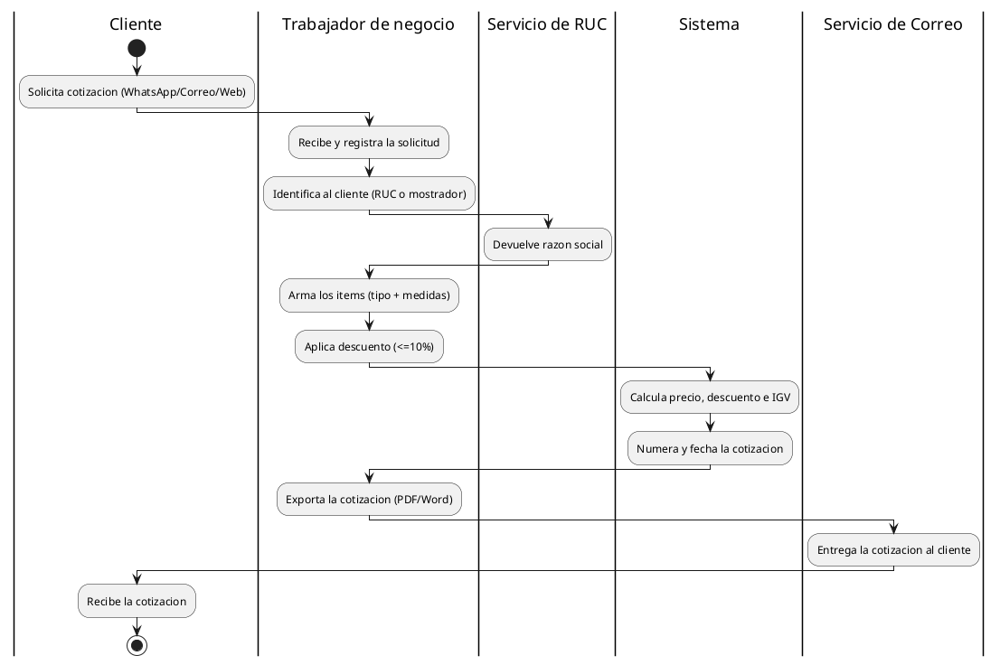

3.4.2 Diagramas de casos de uso del sistema - alta ceremonia (Must / MVP)

Un diagrama por cada caso de uso Must del MVP.

Figura 10. CU-01 Autenticarse

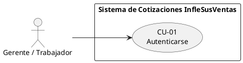

Figura 11. CU-02 Registrar y validar cliente

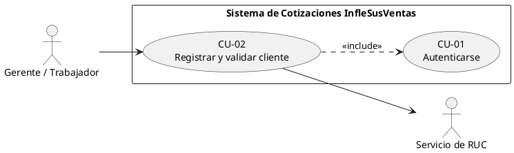

Figura 12. CU-03 Crear cotizacion

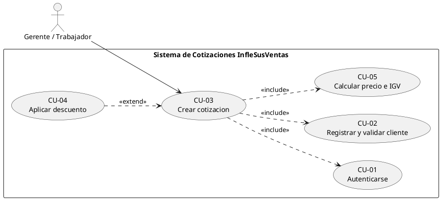

Figura 13. CU-04 Aplicar descuento

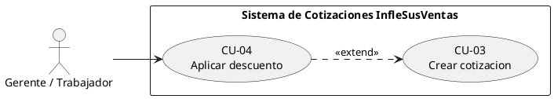

Figura 14. CU-05 Calcular precio e IGV

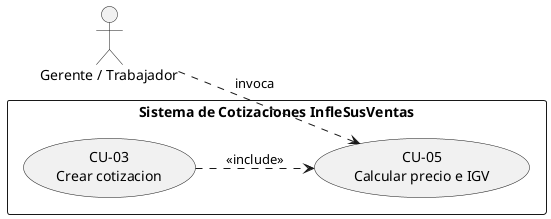

Figura 15. CU-06 Exportar cotizacion

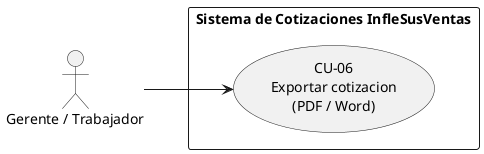

Figura 16. CU-07 Enviar cotización

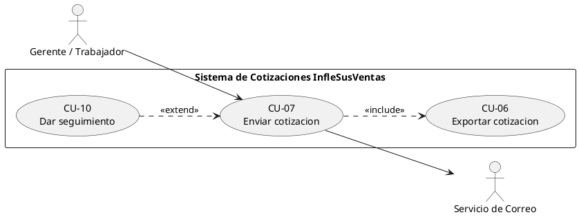

Figura 17. CU-08 Consultar historial y clientes

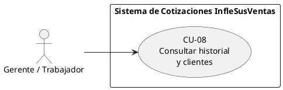

Figura 18. CU-11 Administrar tarifas y parámetros (caso de uso nuevo)

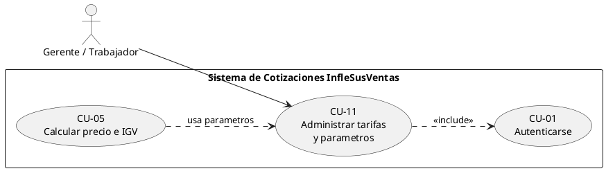

3.4.3 Diagramas de casos de uso del sistema - baja ceremonia (Should)

Casos de uso complementarios (Should), fuera del MVP.

Figura 19. CU-09 Cotizacion rapida

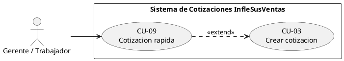

Figura 20. CU-10 Dar seguimiento

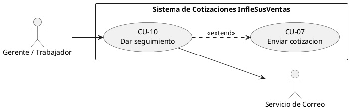

3.5 Diagrama de actividades (crear cotización con seguimiento)

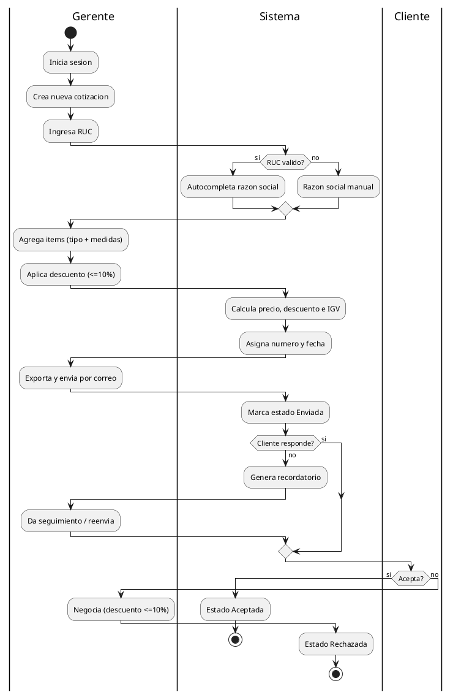

3.6 Diagrama de actividades (AS-IS)

```plantuml
@startuml
          |Cliente|
          start
          :Envia solicitud (WhatsApp/Correo/Web);
          |Gerente|
          :Revisa la solicitud manualmente;
          :Cotiza usando una plantilla;
          :Calcula precio e IGV a mano;
          :Genera y envia el PDF;
          |Cliente|
          :Recibe la cotizacion;
          if (Responde?) then (si)
            if (Acepta?) then (si)
              :Confirma compra;
              stop
            else (no)
              |Gerente|
              :Negocia descuento (<=10%);
              stop
            endif

          else (no)
           |Gerente|
           :Da seguimiento manual e insiste;
           stop
          endif
@enduml
```

3.7 Diagrama de secuencia (cotizar y enviar)

```plantuml
@startuml
          actor Gerente
          participant Sistema
          participant "Servicio RUC" as RUC
          participant "Servicio Correo" as Correo
          Gerente -> Sistema : iniciarSesion(usuario, clave)
          Sistema --> Gerente : sesion validada
          Gerente -> Sistema : ingresarRUC(ruc)
          Sistema -> RUC : validar(ruc)

   RUC --> Sistema : razonSocial / invalido
   Sistema --> Gerente : autocompleta razon social
   Gerente -> Sistema : agregarItems(tipo, medidas)
   Gerente -> Sistema : aplicarDescuento(pct<=10)
   Sistema -> Sistema : calcularPrecioDescuentoIGV()
   Sistema -> Sistema : asignarNumeroYFecha()
   Gerente -> Sistema : exportarYEnviar(correoCliente)
   Sistema -> Correo : enviar(cotizacion.pdf)
   Correo --> Sistema : ok
   Sistema --> Gerente : estado = Enviada
@enduml
```

3.7.1 Diagramas de secuencia complementarios

Figura 21. Secuencia CU-02 Validar RUC y autocompletar

```plantuml
@startuml
       actor "Gerente / Trabajador" as G
       participant Sistema

        participant "Servicio RUC" as RUC
        G -> Sistema : ingresarRUC(ruc)
        Sistema -> RUC : validar(ruc)
        alt Servicio disponible y RUC válido
         RUC --> Sistema : razonSocial
         Sistema --> G : autocompleta razon social (editable)
        else RUC invalido
         RUC --> Sistema : invalido
         Sistema --> G : solicitar razon social manual
        else Servicio no disponible
         RUC --> Sistema : timeout
         Sistema --> G : continuar manual (RNF-06)
        end
        G -> Sistema : guardarCliente(datos)
        Sistema --> G : cliente asociado a la cotizacion
@enduml
```

Figura 22. Secuencia CU-10 Dar seguimiento

```plantuml
@startuml
actor "Gerente / Trabajador" as G

participant Sistema
participant "Servicio Correo" as Correo
Sistema -> Sistema : detectar cotizacion sin respuesta (plazo)
Sistema -> Sistema : estado = En seguimiento
Sistema --> G : notificar recordatorio
G -> Sistema : reenviar(cotizacion, descuento<=10%)
Sistema -> Correo : enviar(cotizacion.pdf)
Correo --> Sistema : ok
Sistema -> Sistema : registrar interaccion (nota, descuento)
alt Cliente acepta
 G -> Sistema : marcarAceptada()
 Sistema --> G : estado = Aceptada
else Cliente rechaza
 G -> Sistema : marcarRechazada()
 Sistema --> G : estado = Rechazada
end
@enduml
```

3.8 Diagrama de clases del dominio

```plantuml
@startuml
                class Usuario {
                  +id
                  +usuario
                  +password
                  +rol
                }
                class Cliente {
                  +id
                  +ruc
                  +razonSocial
                  +correo

                }
                class Cotizacion {
                  +numero
                  +fecha
                  +tipo
                  +subtotal
                  +igv
                  +total
                  +estado
                }
                class Item {
                  +categoria
                  +medidas
                  +cantidad
                  +descripcion
                  +precioBase
                }
                class Descuento {
                  +porcentaje
                  +monto
                }
                class Seguimiento {
                  +fecha
                  +tipo
                  +nota
                }
                class Tarifa {
                  +categoria
                  +rangoTamano
                  +precioUnitario
                }
                Usuario "1" --> "*" Cotizacion : registra
                Cliente "1" --> "*" Cotizacion
                Cotizacion "1" *-- "*" Item
                Cotizacion "1" o-- "0..1" Descuento
                Cotizacion "1" o-- "*" Seguimiento
                Item ..> Tarifa : usa
@enduml
```

Validación de la semana: El equipo revisó los modelos en walkthrough; se acordó que el

cálculo de precio e IGV se modela como CU-05 incluido por CU-03.

## 4. ESPECIFICACIÓN DE REQUISITOS (CASOS DE USO)

4.1 Objetivo de la semana

Documentar los casos de uso con la plantilla del curso (alta y baja ceremonia). El

entregable de desarrollo del proyecto corresponde a los requisitos de prioridad Must, por lo que

se especifican todos los casos de uso que cubren dichos requisitos.

4.2 Acta de reunion

Acta de reunión — Semana 4

Fecha / Hora             25/04/2026, 7:00 p.m.
Modalidad                Virtual
Asistentes               R1, R2, R3, R4
Objetivo del sprint      Especificar los casos de uso Must (alta y baja ceremonia).
Acuerdos y tareas        R3 redacta los CU de alta ceremonia (CU-02, CU-03, CU-05).
R2 redacta los CU breves (CU-01, CU-04, CU-06, CU-07, CU-08).
R4 revisa criterios de aceptacion.
Impedimentos             Ninguno.
Proxima reunion          01/05/2026

4.3 Casos de uso del entregable (Must, MVP) y su ceremonia

El entregable de desarrollo es el conjunto de requisitos Must, que constituyen el MVP y

se presentan en su totalidad. Por su importancia, todos los casos de uso Must se especifican en

alta ceremonia (fully-dressed). Los casos de uso Should (CU-09 y CU-10) son complementarios:

se documentan en baja ceremonia y no se implementaran en código en esta etapa.

CU     Nombre                          Requisitos que cubre             MoSCoW Ceremonia
CU-01 Autenticarse                      RF-46, RF-47                        Must        Alta
CU-02 Registrar y validar cliente       RF-01 a RF-06                       Must        Alta
CU-03 Crear cotizacion                  RF-08 a RF-16, RF-23 a RF-25        Must        Alta

CU-04 Aplicar descuento                  RF-44, RF-45                           Must      Alta
CU-05 Calcular precio e IGV              RF-17 a RF-21                          Must      Alta
CU-06 Exportar cotizacion                RF-26, RF-27                           Must      Alta
CU-07 Enviar cotizacion                  RF-28                                  Must      Alta
CU-08 Consultar historial y clientes     RF-30 a RF-33, RF-35, RF-36            Must      Alta
CU-11 Administrar        tarifas       y RF-18, RF-22, RNF-11                   Must      Alta
parámetros
CU-09 Cotizacion rapida                  RF-39 a RF-43                       Should       Baja
CU-10 Dar seguimiento                    RF-48 a RF-50                       Should       Baja

4.4 Casos de uso de alta ceremonia (Must - MVP)

Se especifican en detalle los nueve casos de uso Must que conforman el MVP. Cada uno

incluye actores, precondición, disparador, flujo principal, flujos alternativos, excepciones,

postcondición, reglas de negocio, criterio de aceptación y requisitos que cubre.

CU-01. Autenticarse

Actor principal          Gerente / Trabajador
Ceremonia                Alta
Prioridad                Must (MVP)
Precondicion             El usuario tiene credenciales registradas y activas
Disparador               El usuario abre el sistema e intenta ingresar
Flujo principal          1. El sistema muestra el formulario de inicio de sesión.
2. El usuario ingresa usuario y contrasena.
3. El sistema valida las credenciales.
4. El sistema abre la sesión y muestra la pantalla principal.
Flujos alternativos      2a. El usuario solicita mostrar u ocultar la contraseña.
Excepciones              3a. Credenciales inválidas: el sistema muestra un mensaje y solicita
reintento.
3b. Usuario inactivo: el sistema deniega el acceso.
Postcondicion            Sesión iniciada y validada; acceso habilitado
Reglas de negocio        RD-09 (uso exclusivo del usuario autorizado)

Criterio de aceptación Con credenciales validas se abre la sesion; con invalidas se deniega (0
accesos sin credencial, RNF-08)
Requisitos               RF-46, RF-47

CU-02. Registrar y validar cliente

Actor principal           Gerente / Trabajador
Actor secundario          Servicio de RUC
Ceremonia                 Alta
Prioridad                 Must (MVP)
Precondicion              Usuario autenticado
Disparador                El usuario ingresa el RUC del cliente
Flujo principal           1. El usuario ingresa el RUC.
2. El sistema consulta el servicio de RUC.
3. Si es valido, autocompleta la razon social (editable).
4. El usuario confirma y guarda el cliente.
Flujos alternativos       2a. RUC invalido: no autocompleta; el usuario ingresa la razon
social.
2b. Servicio no disponible: el usuario continua manualmente
(RNF-06).
Excepciones               El RUC tiene un formato incorrecto: el sistema lo indica y solicita
correccion.
Postcondicion             Cliente registrado y asociado a la cotizacion
Reglas de negocio         RD-09 (uso autorizado); la razon social siempre es editable
Criterio de aceptacion    Con un RUC valido se autocompleta la razon social en < 5 s
Requisitos                RF-01 a RF-06

CU-03. Crear cotizacion

Actor principal           Gerente / Trabajador
Ceremonia                 Alta
Prioridad                 Must (MVP)
Precondicion              Usuario autenticado y cliente identificado
Disparador                Pulsa Nueva Cotizacion

Flujo principal          1. Agrega items eligiendo categoria y medidas.
2. El sistema genera la descripcion automatica de los items estandar.
3. El sistema calcula el precio base (incluye CU-05).
4. El sistema asigna numero correlativo y fecha.
5. El usuario guarda la cotizacion.
Flujos alternativos      1a. Item 'Otros': la descripcion queda en blanco para edicion manual.
3a. El usuario aplica un descuento (extiende CU-04).
Excepciones              Faltan medidas obligatorias de la categoria: el sistema no permite
continuar.
Postcondicion            Cotizacion almacenada en el historial
Reglas de negocio        RD-01, RD-03, RD-04
Criterio de aceptacion   La cotizacion se guarda con numero unico, fecha e items validos
Requisitos               RF-08 a RF-16, RF-23 a RF-25

CU-04. Aplicar descuento

Actor principal          Gerente / Trabajador
Ceremonia                Alta
Prioridad                Must (MVP)
Precondicion             Existe una cotización en edición con al menos un item
Disparador               El usuario decide otorgar un descuento por cantidad
Flujo principal          1. El usuario indica el porcentaje de descuento.
2. El sistema valida el porcentaje contra el tope según la cantidad.
3. El sistema aplica el descuento al subtotal (invoca CU-05).
4. El sistema muestra el desglose actualizado.
Flujos alternativos      2a. Descuento sobre el tope: el sistema lo limita al 10%.
Excepciones              1a. Porcentaje no numérico o negativo: el sistema lo rechaza.
Postcondicion            Descuento aplicado (<=10%) y montos recalculados
Reglas de negocio        RD-08 (descuento <=10% según cantidad)
Criterio de aceptación   Un intento de 15% se limita a 10%; el total refleja el descuento
Requisitos               RF-44, RF-45

CU-05. Calcular precio e IGV

Actor principal          Sistema (invocado por el usuario)

Ceremonia                 Alta
Prioridad                 Must (MVP)
Precondicion              La cotización tiene al menos un ítem
Disparador                Cambio en ítems o en el descuento
Flujo principal           1. Calcula el precio base por ítem según tipo y tamaño.
2. Aplica el descuento (<=10% según cantidad) al total.
3. Obtiene el subtotal con descuento.
4. Aplica el IGV sobre el subtotal.
5. Desglosa precio base, descuento, subtotal, IGV y total.
Flujos alternativos       2a. Descuento sobre el tope: el sistema lo limita al 10%.
Excepciones               Tarifa no definida para la categoría/tamaño: se solicita configurarla
(CU-11).
Postcondicion             Montos calculados y desglosados
Reglas de negocio         RD-02 (IGV sobre subtotal con descuento), RD-08 (tope 10%)
Criterio de aceptacion    Con base 1000 y 10% de descuento, total = 1062 (IGV 18%)
Requisitos                RF-17 a RF-21

CU-06. Exportar cotizacion

Actor principal           Gerente / Trabajador
Ceremonia                 Alta
Prioridad                 Must (MVP)
Precondicion              Existe una cotización guardada con número y fecha
Disparador                El usuario elige exportar la cotizacion
Flujo principal           1. El usuario selecciona el formato (PDF o Word).
2. El sistema genera el documento con el desglose (precio,
descuento, IGV, total).
3. El sistema entrega el archivo para su descarga.
Flujos alternativos       1a. El usuario exporta en ambos formatos.
Excepciones               2a. Error al generar el archivo: el sistema muestra un mensaje y
permite reintentar.
Postcondicion             Documento PDF/Word generado y disponible
Reglas de negocio         El desglose sigue RD-02 (IGV sobre subtotal con descuento)
Criterio de aceptacion    El archivo se genera en < 10 s (RNF-05) con el desglose correcto

Requisitos                RF-26, RF-27

CU-07. Enviar cotizacion

Actor principal            Gerente / Trabajador
Actor secundario           Servicio de Correo
Ceremonia                  Alta
Prioridad                  Must (MVP)
Precondicion               Existe una cotización exportable
Disparador                 El usuario decide enviar la cotización al cliente
Flujo principal            1. El usuario ingresa o confirma el correo del cliente.
2. El sistema adjunta la cotización (incluye CU-06).
3. El sistema envía el correo mediante el servicio de correo.
4. El sistema registra el estado 'Enviada'.
Flujos alternativos        4a. El usuario reenvia una cotización ya enviada (puede
extenderse a CU-10).
Excepciones                1a. Correo con formato invalido: el sistema lo indica y no envia.
3a. Fallo del servicio de correo: no marca como enviada y permite
reintentar.
Postcondicion              Cotización enviada y estado registrado
Reglas de negocio          RD-10 (si no hay respuesta, pasa a seguimiento)
Criterio de aceptacion     Con un correo valido se envía y el estado cambia a 'Enviada'; con
invalido no se envia
Requisitos                 RF-28 (y RF-29 registro de estado, Should)

CU-08. Consultar historial y clientes

Actor principal            Gerente / Trabajador
Ceremonia                  Alta
Prioridad                  Must (MVP)
Precondicion               Existen cotizaciones o clientes registrados
Disparador                 El usuario abre el historial desde la barra lateral
Flujo principal            1. El usuario abre el historial o la lista de clientes.
2. El sistema muestra las cotizaciones con numero, cliente, fecha y
estado.

3. El usuario filtra o busca por numero, cliente o fecha.
4. El usuario abre una cotización para consultarla.
Flujos alternativos        3a. Sin resultados: el sistema muestra un aviso.
4a. El usuario reabre o duplica una cotizacion (RF-37, RF-38).
Excepciones                Sin excepciones críticas.
Postcondicion              Información consultada; sin cambios en los datos
Reglas de negocio          RD-01 (la numeración única facilita la busqueda)
Criterio de aceptacion     El historial lista todas las cotizaciones y permite abrir cualquiera
por su numero
Requisitos                 RF-30 a RF-33, RF-35, RF-36

CU-11. Administrar tarifas y parámetros

Actor principal            Gerente
Ceremonia                  Alta
Prioridad                  Must (MVP)
Precondicion               Usuario autenticado (incluye CU-01)
Disparador                 El gerente accede a la configuración del sistema
Flujo principal            1. El gerente abre la configuración.
2. Edita las tarifas por categoría y rango de tamaño.
3. Configura el % de IGV, el tope de descuento, el correlativo
inicial y el plazo de recordatorio.
4. El sistema valida y guarda los parámetros.
Flujos alternativos        2a. Alta de una nueva tarifa para una categoría/tamaño sin tarifa.
Excepciones                4a. Valor invalido (por ejemplo, IGV negativo): el sistema lo
rechaza.
Postcondicion              Parámetros y tarifas actualizados; disponibles para CU-05
Reglas de negocio          RD-07 (tarifas por tipo+tamaño, parametrizables), RD-02, RD-08
Criterio de aceptación     Cambiar una tarifa o el % de IGV se refleja en el siguiente cálculo
sin recompilar (RNF-11, <= 5 min)
Requisitos                 RF-18, RF-22, RNF-11

4.4.1 Diagramas de actividad complementarios

Diagramas de actividad de apoyo para los casos de uso Must con lógica interna relevante.

Figura 23. Actividad CU-02 Registrar y validar cliente

```plantuml
@startuml
left to right direction
skinparam packageStyle rectangle
actor "Gerente / Trabajador" as G
actor "Servicio de Correo" as MAIL
rectangle "Sistema de Cotizaciones InfleSusVentas" {
  usecase "CU-07\nEnviar cotizacion" as UC7
  usecase "CU-10\nDar seguimiento" as UC10
}
G --> UC10
UC10 ..> UC7 : <<extend>>
UC10 --> MAIL
@enduml
```

```plantuml
@startuml
|Gerente / Trabajador|
start
:Ingresar RUC del cliente;
|Sistema|
:Consultar servicio de RUC;
if (Servicio disponible?) then (si)
  if (RUC valido?) then (si)
    :Autocompletar razon social (editable);

  else (no)
   :No autocompletar;
   |Gerente / Trabajador|
   :Ingresar razon social manualmente;
  endif
else (no)
  |Gerente / Trabajador|
  :Continuar con razon social manual (RNF-06);
endif
|Gerente / Trabajador|
:Confirmar y guardar cliente;
|Sistema|
:Asociar cliente a la cotizacion;
stop
@enduml
```

Figura 24. Actividad CU-05 Calcular precio e IGV

```plantuml
@startuml
|Sistema|
start
:Recibir items y descuento;
if (Tarifa definida para categoria/tamano?) then (no)
  :Solicitar configurar tarifa (CU-11);
  stop
else (si)

endif
:Calcular precio base por item (tipo + tamano);
:Sumar precios base;
if (descuento > 10%?) then (si)
  :Limitar descuento al 10%;
else (no)
endif
:subtotal = base - descuento;
:IGV = subtotal * 18%;
:total = subtotal + IGV;
:Desglosar base, descuento, subtotal, IGV y total;
stop
@enduml
```

Figura 25. Actividad CU-10 Dar seguimiento

```plantuml
@startuml
|Sistema|
start
:Cotizacion en estado Enviada;
:Iniciar temporizador de plazo;

       if (Cliente responde en el plazo?) then (si)
         |Cliente|
         if (Acepta?) then (si)
           |Sistema|
           :Estado = Aceptada;
           stop
         else (no)
           |Sistema|
           :Estado = Rechazada;
           stop
         endif
       else (no)
         |Sistema|
         :Estado = En seguimiento;
         :Generar recordatorio;
         |Gerente / Trabajador|
         :Reenviar / negociar (descuento <= 10%);
         :Registrar interaccion y notas;
         |Sistema|
         :Volver a estado Enviada;
         stop
       endif
@enduml
```

4.5 Casos de uso de baja ceremonia (Should - complementario)

Casos de uso de prioridad Should. Son complementarios al MVP, se describen de forma

breve y no se implementarán en código en esta etapa.

CU          Objetivo                  Flujo resumido            Prioridad      Requisitos
CU-09 Cotizar rápido sin Registra items sin validar RUC;           Should     RF-39 a RF-43
RUC (mostrador) fecha por mes; almacena por
separado
CU-10 Recuperar ventas Marca 'En seguimiento', genera              Should     RF-48 a RF-50
sin respuesta    recordatorio y permite reenviar o
negociar

Validación de la semana: El Gerente validó los flujos de los casos de uso Must (MVP)

con datos reales de ejemplo; los criterios de aceptacion se consideraron demostrables. Se

confirmo que el MVP a presentar corresponde a la totalidad de los requisitos Must.

## 5. GESTIÓN DE REQUISITOS Y PRIORIZACIÓN

5.1 Objetivo de la semana

Administrar los requisitos (atributos, linea base) y priorizarlos con MoSCoW, Kano y

Valor/Costo para definir el MVP. El entregable de desarrollo del proyecto son los requisitos

Must.

5.2 Acta de reunion

Acta de reunión — Semana 5

Fecha / Hora                01/05/2026, 7:00 p.m.
Modalidad                   Virtual
Asistentes                  R1, R2, R3, R4
Objetivo del sprint         Priorizar los requisitos y definir el MVP.
Acuerdos y tareas           R1 define atributos y línea base.
R2 aplica MoSCoW y Kano.
R4 calcula Valor/Costo.
El equipo consolida el análisis integrado y el roadmap de MVP.
Impedimentos                Ninguno.
Proxima reunion             08/05/2026

5.3 Atributos de gestion

ID                 Fuente                       Tipo          Prioridad    Estado        Version
RF-01      Entrevista 2 / Escenario 1          Funcional          Must      Aprobado         1.0
RF-44      Entrevista 1 / Escenario 2          Funcional          Must      Aprobado         1.0
RF-48      Escenario 2                         Funcional         Should     Propuesto        0.1
RNF-04 Analisis tecnico                       No funcional         Must      Aprobado         1.0
RD-08      Entrevista 1                         Dominio           Must      Aprobado         1.0

Línea base: se congela la línea base 1.0 al aprobar los RF y RNF; los cambios posteriores

se gestionan mediante RFC/CCB (Semana 12).

5.4 MoSCoW

Nivel   Funcionalidades
Must    Autenticacion (RF-46,47); RUC (RF-01-06); catalogo+medidas (RF-08-16);
descuento (RF-44,45); precio+IGV (RF-17-21); numeracion+fecha (RF-23-25);
exportar (RF-26,27); enviar (RF-28); sidebar+historial (RF-30-33,35,36)
Should Cotizacion rapida (RF-39-42); seguimiento (RF-48-50); IGV configurable (RF-22);
estado de envio (RF-29); filtros (RF-34); reutilizar (RF-07); reabrir (RF-37)
Could    Duplicar (RF-38); convertir rapida->estandar (RF-43); bitácora (RNF-10)
Won't    Captura automática de canales; facturacion; inventario; pagos; multi-rol

El entregable de desarrollo (MVP 1) corresponde a todos los requisitos Must,

cubiertos por los casos de uso CU-01 a CU-08.

5.5 Analisis Kano

Funcionalidad                           Tipo Kano      Explicacion
Autenticacion del gerente                 Básico       Esperado: sin acceso seguro no se opera
Validar RUC y autocompletar               Básico       Se espera;       su   ausencia   genera
insatisfacción
Cálculo de precio e IGV                   Básico       Fundamental para cotizar
Numeración y fecha automáticas            Básico       Esperado
Guardar en historial                      Básico       Esperado
Descuento (máx 10% por cantidad)        Desempeño      Ayuda a cerrar ventas; a mejor manejo,
más conversion
Exportar a PDF/Word                     Desempeño      A más formatos        y    rapidez, mas
satisfaccion
Enviar por correo                       Desempeño      Mejora la experiencia frente al envio
manual
Buscar/filtrar historial                Desempeño      Cuanto mejor, más útil
Cotizacion rapida                     Encantamiento Extra que agiliza casos urgentes

Seguimiento              (estados      y Encantamiento Recupera ventas que se enfriaran
recordatorios)
Duplicar/convertir cotización            Encantamiento Comodidad no esperada

5.6 Valor vs Costo

Funcionalidad                                      Valor              Costo           Prioridad
Cálculo de precio + IGV                             Alto              Medio              1
Validacion de RUC + autocompletar                   Alto              Medio              1
Catalogo + logica de medidas                        Alto              Medio              1
Numeracion + fecha                                  Alto              Bajo               1
Exportar + enviar                                   Alto              Medio              1
Sidebar + historial                                 Alto              Bajo               1
Autenticacion                                       Alto              Bajo               1
Descuento (<=10%)                                   Alto              Bajo               1
Cotizacion rapida                                Medio-Alto           Medio              2
Seguimiento                                         Alto              Medio              2
Duplicar / convertir; bitácora                     Medio              Medio              3

5.7 Análisis integrado y roadmap de MVP

Funcionalidad (RF)                   MoSCoW       Kano        Valor           Costo      MVP
Autenticacion (RF-46,47)              Must       Básico       Alto            Bajo       MVP 1
Validar RUC (RF-01-05)                Must       Básico       Alto            Medio      MVP 1
Clientes (RF-06)                      Must       Básico       Alto            Bajo       MVP 1
Catalogo         +        medidas     Must       Básico       Alto            Medio      MVP 1
(RF-08-16)
Descuento (RF-44,45)                  Must     Desempeño      Alto            Bajo       MVP 1
Precio + IGV (RF-17-21)               Must       Básico       Alto            Medio      MVP 1
Numeracion           +       fecha    Must       Básico       Alto            Bajo       MVP 1
(RF-23-25)
Exportar (RF-26,27)                   Must     Desempeño      Alto            Medio      MVP 1

Enviar (RF-28)                     Must      Desempeño     Alto       Medio       MVP 1
Sidebar    +           historial   Must        Básico      Alto       Bajo        MVP 1
(RF-30-36)
Cotizacion               rapida    Should    Encantamie Medio-Alto    Medio       MVP 2
(RF-39-42)                                      nto
Seguimiento (RF-48-50)             Should    Encantamie    Alto       Medio       MVP 2
nto
Duplicar/convertir                 Could     Encantamie   Medio       Medio       MVP 3
(RF-38,43); bitacora                            nto

- MVP 1 (entregable): acceso autenticado y cotizacion estándar de extremo a extremo (CU-01

a CU-08).

- MVP 2: cotización rápida y seguimiento.

- MVP 3: duplicar/convertir y bitácora.

Validación de la semana: El equipo y el Gerente aprobaron el MVP 1 (requisitos Must)

como entregable de desarrollo.

## 6. REQUISITOS FUNCIONALES

6.1 Objetivo de la semana

Consolidar el catálogo completo de requisitos funcionales derivados de la elicitación, con

su prioridad MoSCoW (M=Must, S=Should, C=Could).

6.2 Acta de reunion

Acta de reunión — Semana 6

Fecha / Hora              08/05/2026, 7:00 p.m.
Modalidad                 Virtual
Asistentes                R1, R2, R3, R4
Objetivo del sprint       Redactar el catálogo de requisitos funcionales.
Acuerdos y tareas         R2 redacta los RF por modulo.
R4 asigna prioridad y criterio de aceptación.
R1 verifica la trazabilidad con las necesidades.
Impedimentos              Ninguno.
Proxima reunion           15/05/2026

6.3 Acceso y seguridad

ID        Prio. Requisito
RF-46        M    El sistema debe requerir el inicio de sesión (usuario y contraseña) del
gerente/trabajador.
RF-47        M    El sistema debe permitir el uso exclusivo del usuario autorizado, validando la
sesión y permitiendo cerrarla.

6.4 Gestión de clientes y validación de RUC

ID        Prio. Requisito
RF-01        M    El sistema debe permitir ingresar el RUC del cliente al crear una cotización
estándar.
RF-02        M    El sistema debe validar el RUC contra el servicio externo.

RF-03      M    El sistema debe autocompletar la razón social cuando el RUC sea válido.
RF-04      M    El sistema no debe autocompletar la razón social cuando el RUC no sea
válido.
RF-05      M    El sistema debe permitir que la razón social sea siempre editable por el
usuario.
RF-06      M    El sistema debe registrar y listar los clientes cotizados.
RF-07      S    El sistema debería permitir reutilizar los datos de un cliente existente.

6.5 Creación de cotizaciones y catálogo

ID     Prio. Requisito
RF-08      M    El sistema debe permitir crear una cotización con uno o varios ítems.
RF-09      M    El sistema debe ofrecer las categorías globos, arcos, carpas, tótems,
skydancers y otros.
RF-10      M    El sistema debe solicitar solo la altura para globos, derivando el diámetro por
proporción.
RF-11      M    El sistema debe solicitar el largo y el alto para arcos.
RF-12      M    El sistema debe solicitar alto, largo y ancho (cuadrangular) o diámetro y
altura (circular) para carpas.
RF-13      M    El sistema debe solicitar solo la altura para tótems y skydancers.
RF-14      M    El sistema debe solicitar alto, ancho y largo para la categoría "Otros".
RF-15      M    El sistema debe generar automáticamente la descripción de los ítems
estándar.
RF-16      M    El sistema debe dejar en blanco y editable la descripción cuando el ítem sea
"Otros".

6.6 Precios, descuento e IGV

ID     Prio. Requisito
RF-17      M    El sistema debe calcular el precio base según el tipo y el tamaño del ítem.
RF-18      M    El sistema debe permitir tarifas parametrizables.
RF-44      M    El sistema debe permitir aplicar un descuento sobre el precio base.
RF-45      M    El sistema debe validar que el descuento no supere el 10% según la cantidad.

RF-19      M    El sistema debe sumar los precios base y aplicar el descuento para obtener el
subtotal.
RF-20      M    El sistema debe aplicar el IGV sobre el subtotal ya con descuento.
RF-21      M    El sistema debe desglosar el precio, el descuento, el subtotal, el IGV y el
total.
RF-22      S    El sistema debería permitir configurar el porcentaje de IGV.

6.7 Numeración, exportación, envío e interfaz

ID     Prio. Requisito
RF-23     M    El sistema debe numerar automáticamente cada cotización de forma
incremental (desde 1001).
RF-24     M    El sistema debe garantizar que el número de cotización sea único e irrepetible.
RF-25     M    El sistema debe registrar automáticamente la fecha de emisión.
RF-26     M    El sistema debe permitir descargar la cotización en PDF.
RF-27     M    El sistema debe permitir descargar la cotización en Word.
RF-28     M    El sistema debe permitir ingresar el correo del cliente y enviar la cotización.
RF-29      S   El sistema debería registrar el estado de envío.
RF-30     M    El sistema debe mostrar una barra lateral (sidebar) de navegación.
RF-31     M    El sistema debe permitir el acceso al historial por cotización.
RF-32     M    El sistema debe mostrar la lista de clientes.
RF-33     M    El sistema debe mostrar el botón "Nueva Cotización".
RF-34      S   El sistema debería permitir buscar y filtrar el historial.
RF-35     M    El sistema debe guardar cada cotización con todos sus datos.
RF-36     M    El sistema debe mostrar el historial general.
RF-37      S   El sistema debería permitir reabrir y consultar una cotización histórica.
RF-38     C    El sistema podría permitir duplicar una cotización previa.

6.8 Cotizacion rapida y seguimiento

ID     Prio. Requisito
RF-39     S    El sistema debería ofrecer un flujo alterno de cotización rápida.

RF-40      S     El sistema debería omitir la validación de RUC en la cotización rápida.
RF-41      S     El sistema debería registrar solo el mes en la fecha de la cotización rápida.
RF-42      S     El sistema debería almacenar las cotizaciones rápidas de forma separada.
RF-43      C     El sistema podría permitir convertir una cotización rápida en estándar.
RF-48      S     El sistema debería registrar y           actualizar   el   estado   (Enviada/En
seguimiento/Aceptada/Rechazada).
RF-49      S     El sistema debería generar un recordatorio cuando no haya respuesta.
RF-50      S     El sistema debería registrar las interacciones y negociaciones (descuento,
reenvíos, notas).

Validacion de la semana: El Gerente verifico que el catalogo refleja todas sus

necesidades; se confirmaron las prioridades Must del entregable.

## 7. REQUISITOS NO FUNCIONALES

7.1 Objetivo de la semana

Definir los requisitos no funcionales de forma medible (métrica + valor + condición).

7.2 Acta de reunion

Acta de reunión — Semana 7

Fecha / Hora             15/05/2026, 7:00 p.m.
Modalidad                Virtual
Asistentes               R1, R2, R3, R4
Objetivo del sprint      Redactar el catálogo de RNF medibles.
Acuerdos y tareas        R4 redacta los RNF con métrica y verificación.
R3 valida factibilidad técnica.
Impedimentos             Ninguno.
Proxima reunion          22/05/2026

ID          Categoria      Requisito medible                           Verificacion
RNF-01        Usabilidad     Crear una cotizacion completa en <= 5 Test de usuario
min tras inducción
RNF-02        Usabilidad     Interfaz responsive en pantallas >= 360 px Prueba en dispositivos
RNF-03        Usabilidad     Mensajes de validación en español junto Revision de UI
al campo
RNF-04       Rendimiento     Validación de RUC < 5 s en el 95% de Prueba de tiempos
consultas
RNF-05       Rendimiento     Exportación PDF/Word < 10 s                 Prueba de tiempos
RNF-06        Fiabilidad     Continuar manualmente si el servicio de Prueba de fallo
RUC cae (100%)
RNF-07        Fiabilidad     Numeración sin pérdida ni duplicidad Prueba                       de
(100%)                               concurrencia
RNF-08        Seguridad      Autenticación obligatoria; 0 accesos sin Prueba de acceso
credencial

RNF-09       Seguridad     Respaldo de datos con periodicidad <= 24 Revision de backups
h
RNF-10       Seguridad     Bitacora de acciones sensibles con fecha y Revision de logs
usuario
RNF-11    Mantenibilidad Tarifas e IGV configurables             sin Prueba               de
recompilar (<= 5 min)                       configuración
RNF-12      Portabilidad   Operar en Chrome/Edge/Firefox ultimas 2 Prueba                 de
versiones                               compatibilidad
RNF-13    Compatibilidad Integración con el servicio de RUC (API) Prueba de integración
RNF-14    Compatibilidad Integración con el servicio de correo Prueba de integración
(SMTP/API)

Validación de la semana: Los valores objetivo (por ejemplo, < 5 s en la validación de

RUC) se acordaron con el Gerente.

## 8. REQUISITOS DE DOMINIO

8.1 Objetivo de la semana

Capturar las reglas de negocio, el modelo de datos y el ciclo de vida de la cotización,

independientes de la tecnología.

8.2 Acta de reunion

Acta de reunión — Semana 9

Fecha / Hora             29/05/2026, 7:00 p.m.
Modalidad                Virtual
Asistentes               R1, R2, R3, R4
Objetivo del sprint      Definir reglas de dominio, entidades y ER.
Acuerdos y tareas        R2 redacta las reglas RD.
R3 elabora el diagrama entidad-relación y de estados.
Impedimentos             Definir el factor de proporción del globo.
Proxima reunion          06/06/2026

8.3 Reglas de negocio (RD)

ID       Regla de negocio                                      Entidad
RD-01      Numero de cotizacion         unico,   correlativo   e Cotizacion
irrepetible (desde 1001)
RD-02      El IGV se calcula sobre el subtotal ya con descuento Cotizacion
RD-03      Las medidas obligatorias dependen de la categoría Item
del ítem
RD-04      Descripción automática de ítems estándar; 'Otros' en Item
blanco
RD-05      En cotizacion rapida la fecha guarda solo mes/año y Cotizacion rapida
no valida RUC
RD-06      En globos el diámetro se deriva de la altura por un Item (globo)
factor

RD-07     Las tarifas dependen de tipo + tamaño y son Tarifa
parametrizables
RD-08     El descuento no supera el 10% y depende de la Cotización/Descuento
cantidad
RD-09     Uso exclusivo del usuario autorizado (autenticado)   Usuario
RD-10     Cotización sin respuesta pasa a En seguimiento y Cotización/Seguimiento
genera recordatorios

8.3.1 Diagramas de reglas de negocio

Las reglas de negocio de la sección 9.3 se representan como diagramas de actividad y

decisión.

Figura 26. RD-01 Numero unico, correlativo e irrepetible (desde 1001)

```plantuml
@startuml
            start
            :Solicitar emitir cotizacion;
            :Leer ultimo numero asignado;
            if (Existe numeracion previa?) then (si)

     :nuevo = ultimo + 1;
   else (no)
     :nuevo = 1001;
   endif
   if (nuevo ya existe?) then (si)
     :Rechazar / reintentar (evitar duplicidad);
     stop
   else (no)
     :Asignar numero y fecha;
     :Registrar cotizacion;
     stop
   endif
@enduml
```

Figura 27. RD-02 El IGV se calcula sobre el subtotal ya con descuento

```plantuml
@startuml
   start
   :Sumar precios base de los items;
   :Obtener descuento (<= 10%);
   :subtotal = base - descuento;
   :IGV = subtotal * 18%;
   :total = subtotal + IGV;
   note right

    El IGV NUNCA se calcula sobre
    el precio base sin descuento
   end note
   :Desglosar base, descuento,
   subtotal, IGV y total;
   stop
@enduml
```

Figura 28. RD-03 Las medidas obligatorias dependen de la categoria del item

```plantuml
@startuml
   start
   :Seleccionar categoria del item;
   switch (Categoria?)
   case (Globo/Totem/Skydancer)
     :Exigir solo Altura;
   case (Arco)
     :Exigir Largo y Alto;
   case (Carpa cuadrangular)
     :Exigir Alto, Largo, Ancho;
   case (Carpa circular)
     :Exigir Diametro y Altura;
   case (Otros)
     :Exigir Alto, Ancho, Largo;
   endswitch
   if (Medidas obligatorias completas?) then (si)
     :Aceptar el item;
     stop

         else (no)
          :Bloquear: no permite continuar;
          stop
         endif
@enduml
```

Figura 29. RD-04 Descripcion automatica de items estandar; 'Otros' en blanco

```plantuml
@startuml
         start
         :Agregar item a la cotizacion;
         if (Categoria = 'Otros'?) then (si)
           :Dejar descripcion en blanco;
           :Habilitar edicion manual;
         else (no)
           :Generar descripcion automatica
           (categoria + medidas);
         endif
         :Guardar item;
         stop
@enduml
```

Figura 30. RD-05 En cotizacion rapida la fecha guarda solo mes/ano y no valida

RUC

```plantuml
@startuml
   start
   :Iniciar cotizacion rapida;
   :Omitir validacion de RUC;
   :Registrar items;
   :Fecha = solo mes/ano;
   :Guardar en almacenamiento SEPARADO
   de las cotizaciones estandar;
   stop
@enduml
```

Figura 31. RD-06 En globos el diametro se deriva de la altura por un factor

```plantuml
@startuml
   start
   :Seleccionar categoria = Globo;
   :Ingresar Altura (h);
   :diametro = h * factorProporcion;
   note right
     El usuario NO ingresa el diametro;
     se calcula automaticamente
   end note
   :Registrar medidas del globo;
   stop
@enduml
```

Figura 32. RD-07 Las tarifas dependen de tipo + tamano y son parametrizables

```plantuml
@startuml
   start
   :Determinar categoria y rango de tamano;
   :Buscar tarifa parametrizada (categoria, rango);
   if (Tarifa definida?) then (si)
     :precioBase = precioUnitario * cantidad;
     stop
   else (no)
     :Solicitar configurar la tarifa (CU-11);
     note right: Editable sin recompilar (RNF-11)
     stop
   endif
@enduml
```

Figura 33. RD-08 El descuento no supera el 10% y depende de la cantidad

```plantuml
@startuml
   start
   :Ingresar % de descuento segun cantidad;
   if (descuento > 10%?) then (si)
     :Limitar descuento = 10%;
   else (no)
     :Mantener descuento ingresado;
   endif
   :Aplicar descuento al subtotal;
   stop
@enduml
```

Figura 34. RD-09 Uso exclusivo del usuario autorizado (autenticado)

```plantuml
@startuml
          start
          :Solicitar operacion en el sistema;
          if (Sesion autenticada valida?) then (si)
            :Permitir la operacion;
            stop
          else (no)
            :Denegar acceso;
            :Redirigir a inicio de sesion;
            stop
          endif
@enduml
```

Figura 35. RD-10 Cotizacion sin respuesta pasa a En seguimiento y genera

recordatorios

```plantuml
@startuml
           start
           :Cotizacion en estado Enviada;
           :Esperar respuesta del cliente;
           if (Respondio dentro del plazo?) then (si)
             :Mantener flujo normal
             (Aceptada / Rechazada);
             stop
           else (no)
             :Cambiar estado a 'En seguimiento';
             :Generar recordatorio;
             :Notificar al gerente para reenviar;
             stop
           endif
@enduml
```

8.4 Logica de medidas por categoria

Producto                  Medidas requeridas             Descripcion automatica
Globo                    Solo altura (diametro por proporcion)             Si
Arco                     Largo y alto                                      Si
Carpa cuadrangular       Alto, largo, ancho                                Si

Carpa circular        Diametro y altura                                         Si
Totem                 Solo altura                                               Si
Skydancer             Solo altura                                               Si
Otros                 Alto, ancho, largo                                  No (en blanco)

8.5 Entidades del dominio

Entidad          Atributos clave
Usuario          id, usuario, password (hash), nombre, rol, activo
Cliente          id, RUC, razon social, correo, telefono
Cotizacion       numero, fecha, tipo, descuento %, subtotal, IGV, total, estado
Item             id, cotizacion, categoria, subtipo, medidas, cantidad, descripcion, precio base
Descuento        id, cotizacion, cantidad, porcentaje (<=10%), monto
Seguimiento      id, cotizacion, fecha, tipo, nota, descuento propuesto
Tarifa           categoria, rango de tamano, precio unitario
Configuracion    % IGV, correlativo inicial, tope de descuento, plazo de recordatorio

8.6 Diagrama entidad-relacion

```plantuml
@startuml
                            entity Usuario {
                              * id
                              --
                              usuario
                              password
                              rol
                            }
                            entity Cliente {
                              * id
                              --

 ruc
 razon_social
 correo
}
entity Cotizacion {
  * numero
  --
  fecha
  tipo
  descuento_pct
  subtotal
  igv
  total
  estado
}
entity Item {
  * id
  --
  cotizacion_num
  categoria
  medidas
  cantidad
  precio_base
}
entity Seguimiento {
  * id
  --
  cotizacion_num
  fecha
  tipo
  nota
}
entity Tarifa {
  * id
  --
  categoria
  rango
  precio_unit
}
Usuario ||--o{ Cotizacion
Cliente ||--o{ Cotizacion
Cotizacion ||--|{ Item
Cotizacion ||--o{ Seguimiento
Item }o--|| Tarifa
@enduml
```

8.7 Diagrama de estados (ciclo de vida de la cotización)

```plantuml
@startuml
                       [*] --> Borrador
                       Borrador --> Emitida : numerar + fechar
                       Emitida --> Enviada : exportar + enviar
                       Enviada --> EnSeguimiento : sin respuesta
                       EnSeguimiento --> Enviada : reenviar
                       EnSeguimiento --> Aceptada
                       Enviada --> Aceptada
                       EnSeguimiento --> Rechazada
                       Enviada --> Rechazada
                       Aceptada --> [*]
                       Rechazada --> [*]
@enduml
```

Validación de la semana: El Gerente confirmó las reglas de dominio; queda pendiente

definir el factor de proporción del globo antes de la construcción.

## 9. REQUISITOS DE DESARROLLO Y ARQUITECTURA

9.1 Objetivo de la semana

Definir como se construirá el sistema (entorno, proceso, estándares) y la arquitectura en

diagramas PlantUML de paquetes, componentes y despliegue.

9.2 Acta de reunion

Acta de reunión — Semana 10

Fecha / Hora          06/06/2026, 7:00 p.m.
Modalidad             Virtual
Asistentes            R1, R2, R3, R4
Objetivo del sprint   Definir requisitos de desarrollo y arquitectura.
Acuerdos y tareas     R3 define stack y arquitectura.
R1 define metodología y control de versiones.
R4 fija cobertura de pruebas.
Impedimentos          Ninguno.
Proxima reunion       13/06/2026

9.3 Requisitos de desarrollo

Fase                   Requisito               Detalle
Identificacion         Control de versiones    Git + GitHub
Especificacion         Stack tecnologico       Aplicacion web (frontend + backend + BD
relacional)
Especificacion         Entorno                 Navegador web; despliegue local o en nube
Especificacion         Metodologia             Incremental    RUP    + Scrum ligero (sprint
semanal)
Verificacion           Cobertura de pruebas >=   70%     en la logica             de    calculo
(IGV/descuento/medidas)
Gestion de cambios     Proceso RFC/CCB         Ver Semana 12

9.4 Diagrama de paquetes

```plantuml
@startuml
             package "Presentacion" {
               [Sidebar]
               [Formulario Cotizacion]
               [Historial]
             }
             package "Logica de negocio" {
               [Autenticacion]
               [Gestion de Clientes]
               [Gestion de Cotizaciones]
               [Calculo Precio/Descuento/IGV]
               [Seguimiento]
             }
             package "Integracion" {
               [Adaptador RUC]
               [Adaptador Correo]
             }
             package "Datos" {
               [Repositorio]
             }
             [Formulario Cotizacion] --> [Gestion de Cotizaciones]
             [Gestion de Cotizaciones] --> [Calculo Precio/Descuento/IGV]
             [Gestion de Clientes] --> [Adaptador RUC]
             [Gestion de Cotizaciones] --> [Adaptador Correo]
             [Gestion de Cotizaciones] --> [Repositorio]
@enduml
```

9.5 Diagrama de componentes

```plantuml
@startuml
          component "UI Web" as UI
          component "API de Cotizaciones" as API
          component "Servicio de Calculo" as CALC
          component "Adaptador RUC" as RUCAD
          component "Adaptador Correo" as MAILAD
          database "BD Cotizaciones" as DB
          UI --> API
          API --> CALC
          API --> RUCAD
          API --> MAILAD
          API --> DB
          RUCAD --> [API externa RUC]
          MAILAD --> [SMTP/API Correo]
@enduml
```

9.6 Diagrama de despliegue

```plantuml
@startuml
               node "PC del Gerente" {
                 artifact "Navegador Web"
               }
               node "Servidor de Aplicacion" {
                 artifact "App Web / API"
               }
               node "Servidor de BD" {
                 database "BD Cotizaciones"
               }
               cloud "Servicio RUC" as RUC
               cloud "Servicio Correo" as MAIL
               "Navegador Web" --> "App Web / API" : HTTPS
               "App Web / API" --> "BD Cotizaciones" : SQL
               "App Web / API" --> RUC : REST
               "App Web / API" --> MAIL : SMTP/REST
@enduml
```

Validación de la semana: El equipo aprobó la arquitectura y los estándares de

desarrollo.

## 10. REQUISITOS DE CALIDAD (ISO/IEC 25010)

10.1 Objetivo de la semana

Formalizar los RNF como requisitos de calidad medibles según ISO/IEC 25010.

10.2 Acta de reunion

Acta de reunión — Semana 11

Fecha / Hora             13/06/2026, 7:00 p.m.
Modalidad                Virtual
Asistentes               R1, R2, R3, R4
Objetivo del sprint      Elaborar las fichas de calidad ISO 25010.
Acuerdos y tareas        R3 mapea RNF a caracteristicas.
R4 redacta las fichas y métricas.
Impedimentos             Ninguno.
Proxima reunion          20/06/2026

10.3 Mapeo RNF - característica

RNF                                              Caracteristica ISO 25010
RNF-01, RNF-02, RNF-03                           Usabilidad
RNF-04, RNF-05                                   Eficiencia de desempeño
RNF-06, RNF-07                                   Fiabilidad
RNF-08, RNF-09, RNF-10                           Seguridad
RNF-11                                           Mantenibilidad
RNF-12                                           Portabilidad
RNF-13, RNF-14                                   Compatibilidad

10.4 Fichas de calidad

Caracteristica            Eficiencia del desempeño (comportamiento temporal)
Necesidad                 Cotizar sin esperas al validar el RUC

Requisito                 Validar el RUC y autocompletar
Metrica                   Tiempo de respuesta
Valor objetivo            < 5 s en el 95% de las consultas
Verificacion              Prueba de tiempos con 30 RUC de muestra
Prioridad                 Must

Caracteristica            Seguridad (confidencialidad, autenticidad)
Necesidad                 Que solo el personal autorizado use el sistema
Requisito                 Autenticación obligatoria
Metrica                   Accesos no autorizados
Valor objetivo            0 accesos sin credencial válida
Verificacion              Prueba de acceso e intento sin credencial
Prioridad                 Must

Validación de la semana: Las fichas se revisaron contra los valores objetivo definidos en

la Semana 7.

## 11. GESTIÓN DE CAMBIOS

11.1 Objetivo de la semana

Definir el proceso de control de cambios (RFC -> impacto -> CCB -> línea base) y

gestionar un cambio de ejemplo.

11.2 Acta de reunion

Acta de reunión — Semana 12

Fecha / Hora            20/06/2026, 7:00 p.m.
Modalidad               Virtual
Asistentes              R1, R2, R3, R4; Gerente
Objetivo del sprint     Definir el proceso de cambios y evaluar el RFC-01.
Acuerdos y tareas       R1 define el flujo RFC/CCB.
El comite (R1, R4) evalua el RFC-01.
Impedimentos            Ninguno.
Proxima reunion         27/06/2026

11.3 Proceso y caso de cambio

Flujo: Solicitud (RFC) -> Análisis de impacto -> Decisión del comité (CCB) ->

Actualización de la línea base y comunicación. El comité lo integran el líder de proyecto y el

responsable de QA.

ID de cambio                                    RFC-01
Solicitante                                     Gerente
Descripcion                                     Añadir descuento escalonado por rangos de
cantidad
Requisitos afectados                            RF-44, RF-45, RD-08, RF-19, RF-20
Analisis de impacto                             Alcance medio; +1 sprint; riesgo de recalcular
IGV sobre subtotal con descuento
Decision CCB                                    Aprobado (incorporado a la linea base 1.1)

Validacion de la semana: El Gerente y el comité aprobaron el RFC-01; se actualizo la

línea base a 1.1.

## 12. TRAZABILIDAD DE REQUISITOS

12.1 Objetivo de la semana

Construir la matriz de trazabilidad bidireccional y analizar la cobertura.

12.2 Acta de reunión

Acta de reunión — Semana 13

Fecha / Hora            27/06/2026, 7:00 p.m.
Modalidad               Virtual
Asistentes              R1, R2, R3, R4
Objetivo del sprint     Construir la matriz de trazabilidad.
Acuerdos y tareas       R4 arma la matriz requisito-CU-componente-prueba.
R1 analiza cobertura y sobrediseño.
Impedimentos            Ninguno.
Proxima reunion         03/07/2026

12.3 Necesidad -> Requisito

Necesidad                                         Requisitos
RN-01 Agilizar generación                         RF-08 a RF-25
RN-02 Precio, descuento e IGV                     RF-17 a RF-22, RF-44, RF-45
RN-03 Numerar y fechar                            RF-23 a RF-25
RN-04 Historial unico                             RF-06, RF-30 a RF-37
RN-05 Validar RUC                                 RF-01 a RF-05
RN-06 Exportar y enviar                           RF-26 a RF-29
RN-07 Cotizacion rapida                           RF-39 a RF-43
RN-08 Seguimiento                                 RF-48 a RF-50

12.4 Matriz de trazabilidad (Requisito - CU - Componente - Prueba)

Requisito      Caso de uso        Componente                 Prueba             Estado

RF-01   CU-02   Gestion de Clientes       CP-01   Por verificar
RF-02   CU-02   Gestión de Clientes       CP-02   Por verificar
RF-03   CU-02   Gestión de Clientes       CP-03   Por verificar
RF-04   CU-02   Gestión de Clientes       CP-04   Por verificar
RF-05   CU-02   Gestión de Clientes       CP-05   Por verificar
RF-06   CU-08   Historial/UI              CP-06   Por verificar
RF-07   CU-02   Gestión de Clientes       CP-07   Por verificar
RF-08   CU-03   Gestión de Cotizaciones   CP-08   Por verificar
RF-09   CU-03   Gestión de Cotizaciones   CP-09   Por verificar
RF-10   CU-03   Gestión de Cotizaciones   CP-10   Por verificar
RF-11   CU-03   Gestión de Cotizaciones   CP-11   Por verificar
RF-12   CU-03   Gestión de Cotizaciones   CP-12   Por verificar
RF-13   CU-03   Gestión de Cotizaciones   CP-13   Por verificar
RF-14   CU-03   Gestión de Cotizaciones   CP-14   Por verificar
RF-15   CU-03   Gestión de Cotizaciones   CP-15   Por verificar
RF-16   CU-03   Gestión de Cotizaciones   CP-16   Por verificar
RF-17   CU-05   Servicio de Cálculo       CP-17   Por verificar
RF-18   CU-05   Servicio de Calculo       CP-18   Por verificar
RF-19   CU-05   Servicio de Calculo       CP-19   Por verificar
RF-20   CU-05   Servicio de Calculo       CP-20   Por verificar
RF-21   CU-05   Servicio de Calculo       CP-21   Por verificar
RF-22   CU-05   Servicio de Calculo       CP-22   Por verificar
RF-23   CU-03   Gestión de Cotizaciones   CP-23   Por verificar
RF-24   CU-03   Gestión de Cotizaciones   CP-24   Por verificar
RF-25   CU-03   Gestión de Cotizaciones   CP-25   Por verificar
RF-26   CU-06   Exportador                CP-26   Por verificar
RF-27   CU-06   Exportador                CP-27   Por verificar
RF-28   CU-07   Adaptador Correo          CP-28   Por verificar
RF-29   CU-07   Adaptador Correo          CP-29   Por verificar
RF-30   CU-08   Historial/UI              CP-30   Por verificar
RF-31   CU-08   Historial/UI              CP-31   Por verificar

RF-32            CU-08       Historial/UI                 CP-32          Por verificar
RF-33            CU-08       Historial/UI                 CP-33          Por verificar
RF-34            CU-08       Historial/UI                 CP-34          Por verificar
RF-35            CU-08       Historial/UI                 CP-35          Por verificar
RF-36            CU-08       Historial/UI                 CP-36          Por verificar
RF-37            CU-08       Historial/UI                 CP-37          Por verificar
RF-38            CU-08       Historial/UI                 CP-38          Por verificar
RF-39            CU-09       Gestión de Cotizaciones      CP-39          Por verificar
RF-40            CU-09       Gestión de Cotizaciones      CP-40          Por verificar
RF-41            CU-09       Gestión de Cotizaciones      CP-41          Por verificar
RF-42            CU-09       Gestión de Cotizaciones      CP-42          Por verificar
RF-43            CU-09       Gestión de Cotizaciones      CP-43          Por verificar
RF-44            CU-04       Servicio de Cálculo          CP-44          Por verificar
RF-45            CU-04       Servicio de Cálculo          CP-45          Por verificar
RF-46            CU-01       Autenticacion                CP-46          Por verificar
RF-47            CU-01       Autenticacion                CP-47          Por verificar
RF-48            CU-10       Servicio de Seguimiento      CP-48          Por verificar
RF-49            CU-10       Servicio de Seguimiento      CP-49          Por verificar
RF-50            CU-10       Servicio de Seguimiento      CP-50          Por verificar

12.5 Analisis de cobertura

- Cobertura directa: cada RF se vincula a un caso de uso, un componente y un caso de prueba.

- Cobertura inversa: cada componente y prueba se justifica en al menos un requisito (sin

sobrediseño).

- Los RNF se trazan a las características ISO 25010 (Semana 11).

Validación de la semana: La matriz mostró cobertura del 100% de los requisitos Must;

no se detectó sobrediseño.

## 13. VALIDACIÓN Y VERIFICACIÓN

13.1 Objetivo de la semana

Demostrar con evidencia que los requisitos son correctos y completos (validación) y

están bien construidos (verificación), mediante walkthrough, prototipos y casos de aceptación.

13.2 Acta de reunion

Acta de reunión — Semana 14

Fecha / Hora              03/07/2026, 7:00 p.m.
Modalidad                 Presencial en la empresa
Asistentes                R1, R2, R3, R4; Gerente
Objetivo del sprint       Validar los requisitos con el Gerente (walkthrough y prototipos).
Acuerdos y tareas         R4 conduce el walkthrough.
R3 presenta los prototipos.
El Gerente ejecuta los casos de aceptación.
Impedimentos              Ninguno.
Proxima reunion           Cierre del proyecto

13.3 Walkthrough (checklist por requisito)

Criterio                       RF-01           RF-17      RF-28         RF-44       RNF-04
Claro y sin ambigüedad            Si            Si           Si           Si           Si
Completo                          Si            Si           Si           Si           Si
Verificable/medible               Si            Si           Si           Si           Si
Consistente                       Si            Si           Si           Si           Si
Factible                          Si            Si           Si           Si           Si

13.4 Casos de aceptación (UAT en Gherkin)

Escenario: Validacion de RUC valido
Dado que el usuario ingresa un RUC válido
Cuando el sistema consulta el servicio de RUC

Entonces se autocompleta la razon social y el campo queda editable

Escenario: Calculo de IGV con descuento
Dado una cotizacion con precio base S/ 1000 y 10% de descuento
Cuando el sistema calcula el subtotal y el IGV del 18%
Entonces el subtotal es S/ 900, el IGV es S/ 162 y el total es S/ 1062

Escenario: Tope de descuento
Dado que el usuario intenta aplicar un 15% de descuento
Cuando el sistema valida el tope
Entonces el descuento se limita al 10%

Escenario: Seguimiento sin respuesta
Dado una cotizacion enviada sin respuesta en el plazo
Cuando vence el plazo de recordatorio
Entonces el sistema la marca En seguimiento y genera un recordatorio

Escenario: Cotizacion rapida sin RUC
Dado que el usuario elige Cotizacion Rapida
Cuando registra los items
Entonces la cotizacion se guarda por separado y la fecha registra solo mes y
año

13.5 Analisis de escenarios de excepcion

Escenario                                         Respuesta esperada
Servicio de RUC caído                             Continuar manualmente sin bloquear (RNF-06)
Correo de envio invalido                          Mensaje de error; no marcar como enviada
Item 'Otros' sin descripcion                      Advertir antes de emitir
Descuento mayor al 10%                            Limitar al 10% (RD-08)
Numero correlativo duplicado                      Impedir duplicidad (RNF-07)

13.6 Prototipos y validacion final

Se validaron con el Gerente wireframes en blanco y negro de las pantallas principales:

inicio de sesion, barra lateral, nueva cotizacion (categoria, medidas y descuento), desglose de

precio e IGV, historial y panel de seguimiento. El Gerente ejecuto los casos de aceptación sobre

el prototipo y confirmo que la solución responde a sus necesidades.

Validación de la semana: El Gerente aprobo la especificación completa; los requisitos

Must quedaron validados como entregable de desarrollo (MVP 1).

## Conclusiones

El desarrollo semana a semana permitio construir la SRS del sistema de cotizaciones de

InfleSusVentas de forma incremental y trazable. Se elicitaron los requisitos con entrevistas,

cuestionarios y escenarios; se modelaron en UML; se priorizaron con MoSCoW, Kano y

Valor/Costo; y se validaron con el Gerente. El entregable de desarrollo corresponde a los

requisitos Must (casos de uso CU-01 a CU-08), que conforman el MVP 1 listo para su

construccion.

## Glosario

Termino           Definición
IGV               Impuesto General a las Ventas (18% en Perú)
RUC               Registro Unico de Contribuyentes
Razon Social      Nombre legal asociado a un RUC
Skydancer         Inflable danzante; se cotiza por altura
Totem             Inflable vertical publicitario; se cotiza por altura
MoSCoW            Priorizacion: Must, Should, Could, Won't
Kano              Modelo de satisfacción: Básico, Desempeño, Encantamiento
Alta ceremonia    Caso de uso especificado en detalle (fully dressed)
Baja ceremonia    Caso de uso descrito de forma breve
MVP               Producto mínimo viable
RFC / CCB         Solicitud de cambio / Comité de control de cambios
Acta de reunion   Registro de acuerdos, tareas e impedimentos por sprint
