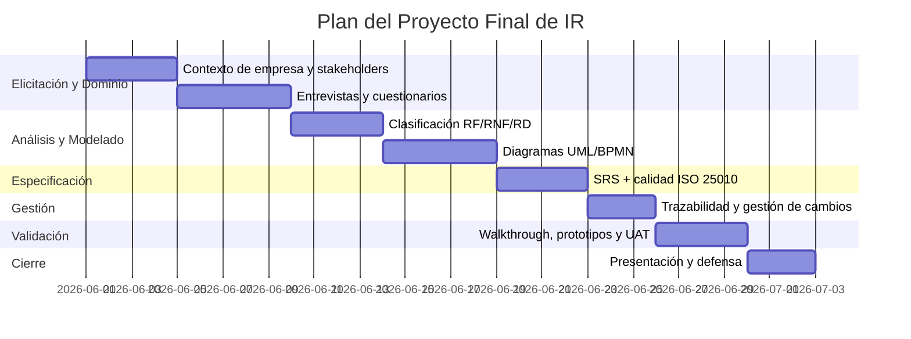

# 🏗️ Estructura del Proyecto Final — Ingeniería de Requisitos

> **Curso:** Ingeniería de Requisitos · **Docente:** Prof. Ciro Rodriguez · UNMSM — Ciclo 5, 2026-I
>
> Estructura **amplia y fiel a la rúbrica del profesor** ([`RubricaProyectoFInal.docx`](../RubricaProyectoFInal.docx))
> y a la [**Guía General de IR**](../Guia_General_IR/README.md). Integra **todos los temas del ciclo
> (14 semanas)**. Es la **plantilla de estructuración**: reemplaza los marcadores
> `[EMPRESA]`, `[SISTEMA]`, `[…]` con los datos reales de tu empresa y ve completando cada sección.

---

## 0. Cómo usar esta estructura

1. **Define tu caso** — completa la [Ficha del proyecto](#1-ficha-del-proyecto-portada-y-datos) con
   tu empresa y el sistema a construir.
2. **Sigue el orden** — cada capítulo corresponde a una o varias semanas del curso y a un criterio
   de la rúbrica; así garantizas que **no falte ningún tema**.
3. **Produce los artefactos** — cada sección indica *qué entregar* (tablas, diagramas, matrices).
4. **Autoevalúate con la rúbrica** — usa la [matriz de trazabilidad rúbrica ↔ secciones](#-matriz-de-trazabilidad-rúbrica--secciones-del-documento)
   y el [checklist para "Excelente"](#-checklist-para-nivel-excelente-90-100) antes de entregar.
5. **Apóyate en la Guía** — cada tema tiene su desarrollo, plantillas y diagramas (Mermaid + PlantUML)
   en la [Guía General](../Guia_General_IR/README.md).

---

## 🎯 Los 6 criterios de la rúbrica (qué evalúa el profesor)

| #   | Criterio                                 | "Excelente" (90-100%) exige…                                                                                    | Semanas del curso  | Capítulos aquí        |
| --- | ---------------------------------------- | --------------------------------------------------------------------------------------------------------------- | ------------------ | --------------------- |
| 1   | **Elicitación y Análisis de Requisitos** | Identificación **exhaustiva y precisa** de RF y RNF + análisis que refleje **comprensión completa del dominio** | S1, S2, S6, S7, S9 | 2, 3, 4               |
| 2   | **Especificación de Requisitos**         | Especificación **clara, completa y organizada** con **estándares** y lenguaje claro                             | S3, S4, S11        | 5, 6                  |
| 3   | **Validación de Requisitos**             | **Métodos de validación efectivos** con evidencia de corrección y completitud                                   | S14                | 8                     |
| 4   | **Gestión de Cambios y Trazabilidad**    | Gestión de cambios efectiva + **trazabilidad completa** requisito→implementación                                | S5, S12, S13       | 7                     |
| 5   | **Comunicación y Presentación**          | Presentación **clara y efectiva** (escrita y oral) con herramientas                                             | Transversal        | 9, 11                 |
| 6   | **Uso de Herramientas y Tecnología**     | Uso **experto** de herramientas de gestión de requisitos                                                        | S5, S13            | Transversal + Anexo B |

> **Meta:** que **cada criterio** tenga evidencia explícita en el documento. La [matriz de
> trazabilidad](#-matriz-de-trazabilidad-rúbrica--secciones-del-documento) lo demuestra al profesor.

---

## 🧭 Mapa del documento (índice general del entregable)

```
Proyecto_Final/
├── Estructura_Proyecto_Final.md   ← este archivo (la estructura/plan)
├── imagenes/                      ← diagramas propios (UML, BPMN, prototipos)
└── (a producir) Documento_SRS_[SISTEMA].md   ← el entregable final, siguiendo esta estructura
```

1. Ficha del proyecto (portada y datos)
2. Introducción y contexto de la empresa
3. Análisis de stakeholders
4. Elicitación de requisitos
5. Análisis y clasificación de requisitos (RF, RNF, RD, Restricciones, Desarrollo)
6. Modelado de requisitos (UML + BPMN)
7. Especificación de requisitos (SRS + calidad ISO 25010)
8. Gestión de requisitos: cambios y **trazabilidad**
9. Validación y verificación
10. Herramientas y tecnologías utilizadas
11. Plan de trabajo, roles y cronograma
12. Presentación y defensa
13. Conclusiones
14. Anexos

---

# 1. Ficha del proyecto (portada y datos)

| Campo | Contenido |
|-------|-----------|
| **Empresa / Cliente** | `[EMPRESA]` — rubro, tamaño, ubicación |
| **Sistema propuesto** | `[SISTEMA]` — nombre y una línea de qué hace |
| **Problema a resolver** | `[…]` (dolor actual del negocio) |
| **Objetivo del proyecto** | `[…]` (meta de alto nivel — ojo: *objetivo*, no requisito) |
| **Alcance** | Qué **sí** y qué **no** cubre el sistema |
| **Equipo** | Integrantes y roles (ver Cap. 11) |
| **Metodología** | RUP / Ágil / híbrida — justificar el grado de **ceremonia** |

> 🔗 *Guía §6 (RUP, ciclos de vida y ceremonia).* Justifica por qué eliges alta o baja ceremonia
> según tu dominio (¿es crítico/regulado como ONPE, o incierto como una startup?).

---

# 2. Introducción y contexto de la empresa

**Qué incluir:**
- 2.1 Descripción de `[EMPRESA]` (misión, procesos de negocio actuales).
- 2.2 Descripción del **problema** (situación actual y sus dolores, con datos si los hay).
- 2.3 **Objetivos** del sistema (generales y específicos) — recuerda: son *metas*, no requisitos.
- 2.4 Justificación y beneficios esperados.
- 2.5 **Espacio del problema vs. espacio de la solución** (Guía §1) — deja claro que primero se
  entiende el negocio.

**Artefacto:** diagrama de **contexto** del negocio (BPMN-like) del proceso actual ("as-is").

> 🔗 *Semana 1 · Guía §1. Criterio de rúbrica: 1 (comprensión del dominio).*

---

# 3. Análisis de stakeholders

**Qué incluir:**
- 3.1 **Lista de stakeholders** (usuarios finales, administradores, clientes, desarrolladores,
  **entidades reguladoras**).
- 3.2 **Matriz Poder / Interés** (a quién priorizar en la elicitación).
- 3.3 Necesidades de calidad por stakeholder (tabla tipo: *Médicos → rapidez; Pacientes →
  privacidad; Administradores → disponibilidad*).

**Artefactos:** tabla de stakeholders + matriz Poder/Interés (`quadrantChart` de la Guía §2).

> 🔗 *Semanas 1, 5, 11 · Guía §2. Criterio: 1.*

---

# 4. Elicitación de requisitos

**Qué incluir (usar ≥ 3 técnicas y justificarlas):**
- 4.1 **Técnicas seleccionadas** y por qué (entrevista, cuestionario, observación, análisis de
  documentos, taller/JAD…).
- 4.2 **Guion de entrevista** con tabla `Pregunta | Objetivo | Tipo (Cerrada/Abierta)` — al estilo
  del ejercicio de reservas de laboratorios (S2).
- 4.3 **Cuestionario** (5+ preguntas) y muestra de resultados.
- 4.4 **Registro de necesidades** elicitadas (voz del usuario, sin traducir aún).
- 4.5 **Traducción necesidad → requisito** (tabla `Usuario | Necesidad | Requisito`, estilo S6).

**Artefactos:** instrumentos de elicitación + tabla de necesidades + tabla necesidad↔requisito.

> 🔗 *Semanas 2 y 6 · Guía §3 y §7. Criterio: 1. La tabla necesidad↔requisito es clave para el
> profesor.*

---

# 5. Análisis y clasificación de requisitos

**Qué incluir — catálogo completo de requisitos por tipo:**

- 5.1 **Requisitos Funcionales (RF)** — tabla con ficha completa (ID, nombre, descripción, actor,
  entrada/salida, regla de negocio, criterio de aceptación, prioridad **MoSCoW**).
- 5.2 **Requisitos No Funcionales (RNF)** — **medibles** (con métrica y valor objetivo). *Nada de
  "rápido"; sí "< 2 s para el 95 % con 500 usuarios".*
- 5.3 **Requisitos de Dominio (RD)** — reglas del negocio del *problem space* (tabla RF/RNF/RD).
- 5.4 **Restricciones** — tecnológicas, legales, presupuestales, físicas.
- 5.5 **Requisitos de Desarrollo** — entorno, metodología (SCRUM/…), herramientas, lenguajes,
  estándares (fases: identificación → especificación → verificación → gestión de cambios).
- 5.6 **Priorización** (MoSCoW) y definición del **MVP**.
- 5.7 **Clasificación Sommerville** (usuario → sistema → diseño) de algunos requisitos clave.

**Artefactos:** catálogo de RF/RNF/RD/Restricciones/Desarrollo + tabla MoSCoW + definición de MVP.

> 🔗 *Semanas 1, 6, 7, 9, 10 · Guía §4, §5, §11–§14, §19. Criterios: 1 y 2.*

---

# 6. Modelado de requisitos (UML + BPMN)

**Qué incluir (diagramas propios de `[SISTEMA]`):**

- 6.1 **Casos de uso** (diagrama + especificación textual de los 3–5 principales, con flujos
  principal y alternativo).
- 6.2 **Diagrama de actividades** (con **particiones/swimlanes** por responsable).
- 6.3 **Diagrama de secuencia** de los flujos críticos.
- 6.4 **Diagrama de clases** del dominio.
- 6.5 **Diagrama de estados** de una entidad con ciclo de vida.
- 6.6 **Modelo Entidad-Relación** del dominio.
- 6.7 **Diagrama de componentes / despliegue** (para sustentar RNF de arquitectura).
- 6.8 **Flujo de negocio BPMN** (proceso "to-be").

> **Notación:** entrega los diagramas en **PlantUML** (notación del profesor) y/o **Mermaid**. Las
> plantillas listas para adaptar están en la **Guía §8 y §20** (cada diagrama en ambas notaciones).

**Artefactos:** ≥ 6 diagramas guardados en [`imagenes/`](imagenes/) + su especificación textual.

> 🔗 *Semanas 3 y 4 · Guía §8, §9, §20. Criterios: 1, 2 y 6.*

---

# 7. Gestión de requisitos: cambios y trazabilidad

**Qué incluir:**

- 7.1 **Atributos gestionados** por requisito (ID, fuente, tipo, prioridad, estado, versión).
- 7.2 **Línea base** de requisitos y control de versiones.
- 7.3 **Matriz de trazabilidad** bidireccional: `Requisito ↔ Caso de uso ↔ Diseño ↔ Código ↔
  Prueba` (directa e inversa; verificar **cobertura** y **sobrediseño**).
- 7.4 **Proceso de gestión de cambios** (flujo RFC → análisis de impacto → **CCB** → línea base).
- 7.5 **Ejemplo de un cambio** real gestionado con su **análisis de impacto**.

**Artefactos:** matriz de trazabilidad completa + diagrama del flujo de cambios + 1 caso de cambio.

> 🔗 *Semanas 5, 12, 13 · Guía §10, §16, §17. Criterio: 4 (¡peso alto!). La trazabilidad
> "requisitos → implementación" es lo que distingue el nivel Excelente.*

---

# 8. Validación y verificación

**Qué incluir (aplicar ≥ 2 técnicas con evidencia):**

- 8.1 **Verificación vs. Validación** (modelo en V): construir *correctamente* vs. el *producto
  correcto*.
- 8.2 **Revisión / Walkthrough** con **checklist** por requisito (claro, completo, verificable,
  consistente, factible) — estilo ejercicio "Gestión de Flota" (S14).
- 8.3 **Prototipos** (wireframes en Figma/Balsamiq) para validar UI.
- 8.4 **UAT** — casos de aceptación en **Gherkin** (Dado/Cuando/Entonces) con criterios medibles.
- 8.5 **Modelos y simulaciones** o **análisis de escenarios** (incluye excepciones/DILO).
- 8.6 **Resultados**: hallazgos, correcciones aplicadas y evidencia de completitud.

**Artefactos:** checklist de walkthrough + wireframes + casos UAT en Gherkin + informe de hallazgos.

> 🔗 *Semana 14 · Guía §18 y §19. Criterio: 3.*

---

# 9. Herramientas y tecnologías utilizadas

**Qué incluir:** tabla justificando cada herramienta por fase.

| Fase | Herramientas sugeridas (elige y justifica) |
|------|--------------------------------------------|
| Gestión de requisitos / backlog | JIRA, Azure DevOps, Trello |
| Modelado (UML/BPMN) | PlantUML, Lucidchart, StarUML, draw.io |
| Prototipado | Figma, Balsamiq |
| Trazabilidad | Matriz en Excel/Google Sheets, JIRA, HP ALM |
| Documentación | Markdown/Docs, Confluence |
| Pruebas / UAT | Google Forms, herramientas de test |

> 🔗 *Semanas 5 y 13 · Guía §10 y §17. Criterio: 6. Demuestra uso "experto": no solo nombrarlas,
> sino evidenciar cómo las usaste (capturas, enlaces).*

---

# 10. (Reservado — el detalle técnico de cada tema vive en los capítulos 2–9)

---

# 11. Plan de trabajo, roles y cronograma

- 11.1 **Roles del equipo** (Analista de requisitos, Modelador, QA/Validación, Documentador,
  Líder/Comunicación).
- 11.2 **Cronograma** (Gantt) por fases de IR.
- 11.3 **RACI** de las actividades principales.

**Artefacto (Gantt de ejemplo, adaptable):**



> 🔗 *Criterio: 5 y 6.*

---

# 12. Presentación y defensa

- 12.1 **Documento escrito** (SRS completo, ordenado, con estándares).
- 12.2 **Exposición oral** (guion, tiempos, quién presenta qué).
- 12.3 **Demostración** de herramientas (JIRA, prototipos, matriz).
- 12.4 **Preguntas anticipadas** del profesor y respuestas preparadas (usa el
  [banco de preguntas de la Guía §23](../Guia_General_IR/README.md#23-banco-de-preguntas-analizar-crear-validar)).

> 🔗 *Criterio: 5 (comunicación escrita y oral).*

---

# 13. Conclusiones

- Cumplimiento de objetivos, lecciones aprendidas, trabajo futuro (roadmap post-MVP).

---

# 14. Anexos

- **Anexo A:** instrumentos de elicitación completos (guiones, cuestionarios, transcripciones).
- **Anexo B:** capturas de las herramientas (JIRA/tablero, prototipos, matriz de trazabilidad).
- **Anexo C:** catálogo completo de requisitos (si es extenso).
- **Anexo D:** glosario del dominio de `[EMPRESA]`.

---

## 📊 Matriz de trazabilidad rúbrica ↔ secciones del documento

> Pégala al inicio del entregable: le demuestra al profesor que **cada criterio está cubierto**.

| Criterio de la rúbrica | Evidencia en el documento | Semanas |
|------------------------|---------------------------|---------|
| **1. Elicitación y Análisis** | Cap. 3 (stakeholders), Cap. 4 (elicitación), Cap. 5 (RF/RNF/RD) | S1, S2, S6, S7, S9 |
| **2. Especificación** | Cap. 5 (catálogo), Cap. 6 (modelado), Cap. 7-doc (SRS + ISO 25010) | S3, S4, S11 |
| **3. Validación** | Cap. 8 (walkthrough, prototipos, UAT, escenarios) | S14 |
| **4. Gestión de Cambios y Trazabilidad** | Cap. 7 (matriz + flujo de cambios) | S5, S12, S13 |
| **5. Comunicación y Presentación** | Cap. 11 (plan), Cap. 12 (defensa), calidad del documento | Transversal |
| **6. Uso de Herramientas** | Cap. 9 (herramientas) + Anexo B (evidencias) | S5, S13 |

---

## ✅ Checklist para nivel "Excelente" (90-100%)

**Criterio 1 — Elicitación y Análisis**
- [ ] ≥ 3 técnicas de elicitación aplicadas y justificadas
- [ ] Tabla necesidad → requisito (traducción explícita)
- [ ] RF y RNF **exhaustivos**; RNF **medibles**; RD del dominio identificados
- [ ] Análisis que demuestra **comprensión completa del dominio**

**Criterio 2 — Especificación**
- [ ] SRS con estructura estándar (IEEE 830 / ISO 29148)
- [ ] Casos de uso con flujos principal y alternativo
- [ ] Requisitos de calidad con la plantilla ISO 25010 (métrica + valor + criterio)
- [ ] Sin ambigüedades ni anti-patrones (ver Guía §22)

**Criterio 3 — Validación**
- [ ] ≥ 2 técnicas de validación con **evidencia**
- [ ] Checklist de walkthrough completado
- [ ] Casos UAT en Gherkin con criterios medibles
- [ ] Informe de hallazgos y correcciones

**Criterio 4 — Gestión de Cambios y Trazabilidad**
- [ ] Matriz de trazabilidad **bidireccional** completa (req → prueba)
- [ ] Verificación de cobertura y sobrediseño
- [ ] Proceso de cambios (RFC → impacto → CCB → línea base) + 1 caso real

**Criterio 5 — Comunicación**
- [ ] Documento claro, ordenado y con estándares
- [ ] Exposición ensayada con roles y tiempos

**Criterio 6 — Herramientas**
- [ ] Herramientas por fase justificadas y **evidenciadas** (capturas/enlaces)

---

> **Fuente de guía:** rúbrica oficial ([`RubricaProyectoFInal.docx`](../RubricaProyectoFInal.docx))
> y [Guía General de IR](../Guia_General_IR/README.md) basada en las 14 semanas del Prof. Ciro
> ([`teoria/`](../teoria/)) y los casos de [`practica/`](../practica/).
